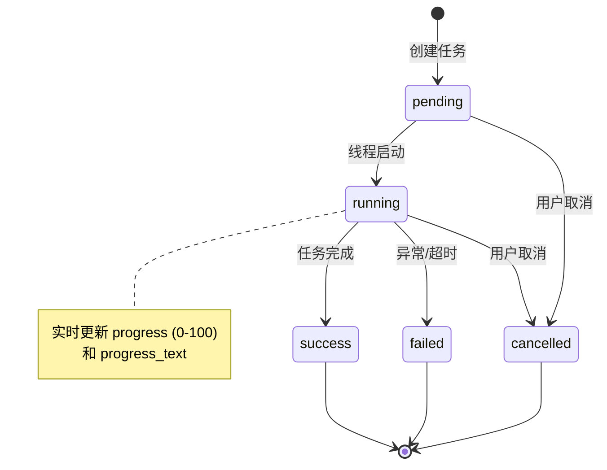
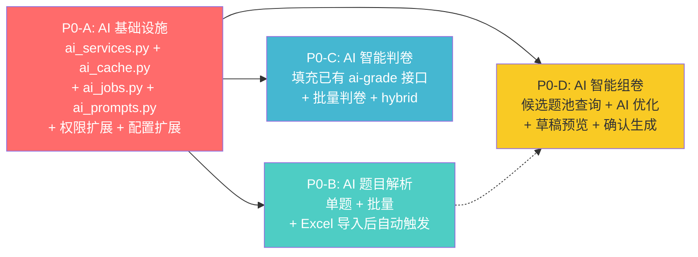
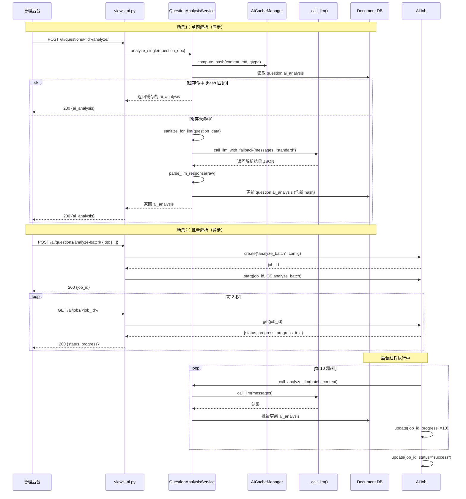
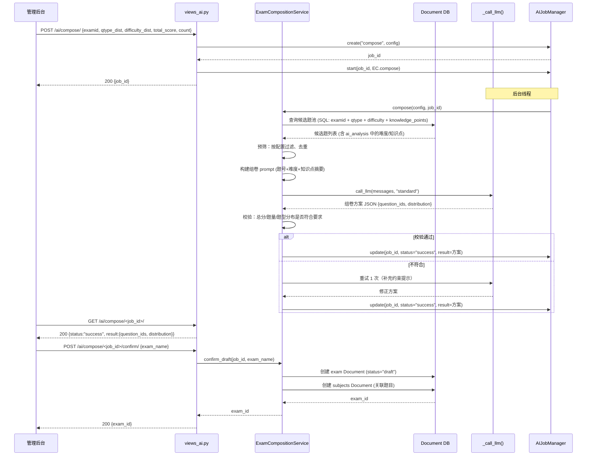
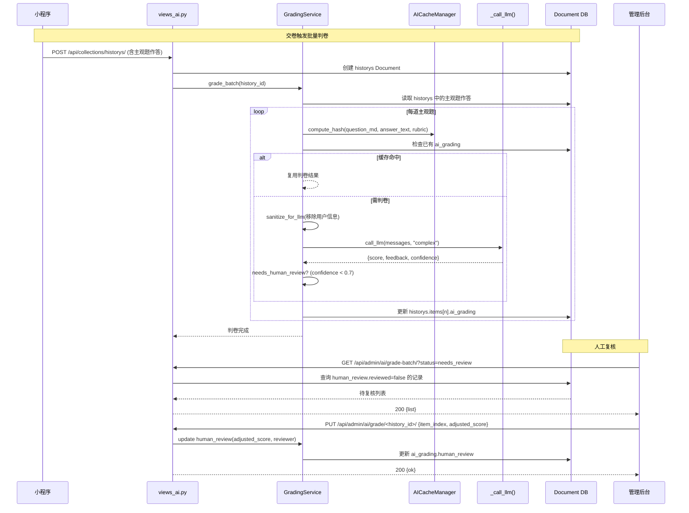
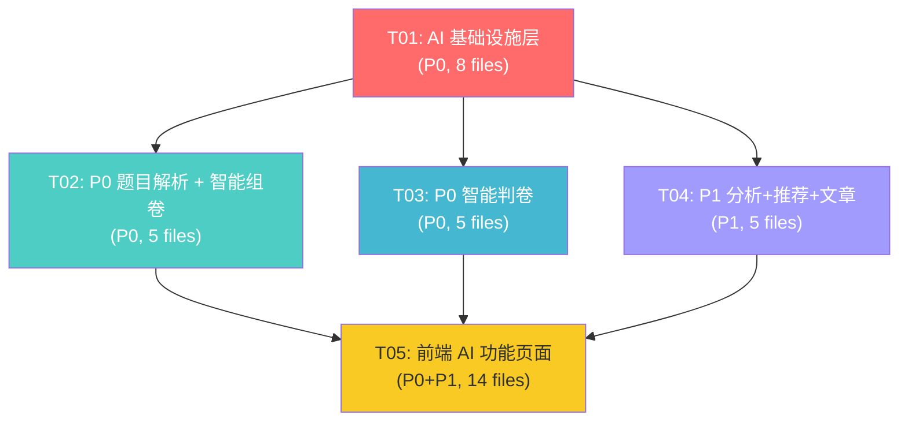

# 考试宝 · AI 能力技术架构设计与实施方案

> 项目：考试宝 — AI 能力增量建设
> 架构师：高见远（Bob / Gao）
> 日期：2026-09
> 状态：待评审

---

## 目录

- [一、总体技术架构设计](#一总体技术架构设计)
- [二、各模块 AI 结果存储与复用策略](#二各模块-ai-结果存储与复用策略)
- [三、Token 成本控制措施](#三token-成本控制措施)
- [四、异步任务方案](#四异步任务方案)
- [五、权限点扩展](#五权限点扩展)
- [六、API 路由设计](#六api-路由设计)
- [七、数据结构设计](#七数据结构设计)
- [八、实现优先级与技术依赖](#八实现优先级与技术依赖)
- [九、潜在风险与注意事项](#九潜在风险与注意事项)
- [十、依赖包列表](#十依赖包列表)
- [附录 A：类图](#附录-a类图)
- [附录 B：关键时序图](#附录-b关键时序图)
- [附录 C：任务分解](#附录-c任务分解)

---

## 一、总体技术架构设计

### 1.1 设计原则

| 原则 | 说明 |
|------|------|
| **最大化复用** | 复用已有 `_call_llm()` 引擎、`ai_config` 配置、`ImportJob` 异步模式、RBAC 权限体系、`Document` 文档模型 |
| **最小化侵入** | AI 能力作为独立服务层叠加在现有架构之上，不改动核心数据模型和已有业务逻辑 |
| **缓存优先** | 所有 AI 结果均持久化缓存，内容未变更时不重复调用 LLM，从根本控制 Token 成本 |
| **渐进式上线** | P0→P1→P2 分批交付，每个功能可独立开关（`ai_config.enabled` + 功能级开关） |
| **安全可控** | 学生数据送入 LLM 前脱敏，AI 生成内容标注来源，人工复核关键环节 |

### 1.2 分层架构

```mermaid
graph TB
    subgraph FL["前端展示层"]
        WA["Web 管理后台<br/>(Vue3 + Element Plus)"]
        MP["微信小程序<br/>(原生 WXML/WXSS/JS)"]
    end

    subgraph BL["业务接口层 (adminapi/)"]
        VA["views_ai.py<br/>AI 接口入口"]
        VD["views_data.py<br/>数据 CRUD + 批量操作"]
        VI["views_import.py<br/>批量导入 + 组卷"]
        VD2["views_dashboard.py<br/>看板 + 分析"]
    end

    subgraph SL["AI 服务层 (新建 ai_services.py)"]
        SB["AIServiceBase<br/>缓存/重试/脱敏/模型选择"]
        QS["QuestionAnalysisService<br/>题目解析"]
        EC["ExamCompositionService<br/>智能组卷"]
        GS["GradingService<br/>主观题判卷"]
        EA["ExamAnalysisService<br/>试卷分析"]
        RR["ReviewRecommendService<br/>复习推荐"]
        LP["LearningProfileService<br/>答题分析"]
        AE["ArticleEnhanceService<br/>文章增强"]
    end

    subgraph IL["基础设施层"]
        CL["_call_llm()<br/>LLM 调用引擎 (已有)"]
        AC["ai_config<br/>AI 配置管理 (已有)"]
        CM["AICacheManager<br/>缓存管理 (新建)"]
        AJ["AIJobManager<br/>异步任务 (新建)"]
        PM["PromptBuilder<br/>Prompt 工具 (新建)"]
        RL["RateLimiter<br/>限流 (已有 cache)"]
    end

    subgraph DL["数据层"]
        DB["SQLite<br/>Document 通用文档模型"]
    end

    FL --> BL
    BL --> SL
    SL --> IL
    IL --> DL
```



### 1.3 与现有系统的集成方式

#### 1.3.1 复用已有基础设施

| 已有组件 | 复用方式 | 扩展点 |
|---------|---------|--------|
| `_call_llm(config, messages)` | 作为所有 AI 服务的底层 LLM 调用入口，不改动 | 新增 `model_override` 参数支持分级模型选择 |
| `ai_config` collection | 继续作为全局 AI 配置（apiUrl/apiKey/model/systemPrompt） | 新增 `feature_config` 子字段，支持各功能独立配置模型/温度/Token 上限 |
| RBAC 权限体系 | 新增 AI 权限点，挂载到现有 3 个内置角色 | 新增 6 个权限点（见第五节） |
| `ImportJob` 异步模式 | 复用 `threading.Thread` + DB 状态轮询模式 | 新建 `AIJob` 通用异步任务管理器，与 ImportJob 同构 |
| `Document` 文档模型 | AI 结果存入已有 collection 的扩展字段 | 新增 3 个 collection：`ai_learning_profile`、`ai_review_plans`、`ai_jobs` |
| Django cache 限流 | 复用现有 cache 机制实现 AI 功能限流 | 扩展限流维度（用户级 + 功能级 + 全局级） |
| `responses.ok/fail` | 所有新 API 统一使用现有响应封装 | 无扩展 |

#### 1.3.2 新增模块文件

| 文件 | 类型 | 说明 |
|------|------|------|
| `backend/adminapi/ai_services.py` | 新建 | AI 服务层核心：服务基类 + 8 个业务服务类 |
| `backend/adminapi/ai_cache.py` | 新建 | AI 缓存管理器：content_hash 计算、缓存读写、失效策略 |
| `backend/adminapi/ai_prompts.py` | 新建 | Prompt 模板库：各功能的 system prompt + user prompt 构建器 |
| `backend/adminapi/ai_jobs.py` | 新建 | 异步任务管理器：线程池 + 状态机 + 进度回调 |
| `backend/adminapi/views_ai.py` | 修改 | 扩展 AI 接口入口，新增 15+ 个视图函数 |
| `backend/adminapi/permissions.py` | 修改 | 新增 6 个 AI 权限点 |
| `backend/adminapi/urls.py` | 修改 | 注册新 AI 路由 |
| `backend/backend/settings.py` | 修改 | 新增 AI 功能级默认配置 |

### 1.4 新增 Collection / Model 概览

| 新增项 | 类型 | 用途 |
|--------|------|------|
| `ai_learning_profile` | collection | 用户学习画像（答题分析结果） |
| `ai_review_plans` | collection | 每日复习推荐清单 |
| `ai_jobs` | collection | 异步 AI 任务状态追踪 |
| `questions.data.ai_analysis` | 字段扩展 | 题目 AI 解析结果 |
| `exam.data.ai_analysis` | 字段扩展 | 试卷 AI 分析结果 |
| `historys.data.ai_grading` | 字段扩展 | 主观题 AI 评分结果 |
| `ai_config.data.feature_config` | 字段扩展 | 功能级 AI 配置 |

---

## 二、各模块 AI 结果存储与复用策略

> **核心设计**：每个 AI 功能的结果均持久化到 Document 中，通过 `content_hash` 实现缓存命中判断。内容未变更时直接复用，内容变更时自动失效重新分析。

### 2.1 存储策略总表

| # | AI 功能 | 存储位置 | 数据结构（核心字段） | 缓存命中条件 | 缓存失效策略 |
|---|---------|---------|---------------------|-------------|-------------|
| 1 | AI 题目解析 | `questions` 文档 `data.ai_analysis` | `{version, content_hash, knowledge_points[], difficulty, qtype_detected, answer_analysis_md, suggested_tags[], analyzed_at, model}` | `ai_analysis.content_hash == hash(content_md + qtype)` | 题目 `content_md` 或 `qtype` 变更时 hash 不匹配 → 自动失效 |
| 2 | AI 智能组卷 | 新建 Document `collection='ai_jobs'`（draft 试卷） | `{job_type:'compose', status, config, result:{question_ids[], total_score, distribution}, created_at}` | 无缓存（每次组卷条件可能不同，不缓存） | 草稿试卷 7 天后自动清理；用户确认后转为正式 exam |
| 3 | AI 智能判卷 | `historys` 文档中单题作答的 `ai_grading` 字段 | `{score, max_score, feedback_md, confidence, model, graded_at, content_hash}` | `ai_grading.content_hash == hash(question_content_md + answer_text + rubric)` | 题目正文/评分标准/考生作答任一变更时失效 |
| 4 | AI 试卷分析 | `exam` 文档 `data.ai_analysis` | `{version, content_hash, quality_report_md, difficulty_analysis, student_analysis, recommendations[], analyzed_at, model, record_count}` | `ai_analysis.content_hash == hash(exam_config + 命中题目集 + 答题记录摘要)` | 试卷配置变更 或 答题记录数增长 ≥10% 时失效 |
| 5 | 错题复习推荐 | 新建 Document `collection='ai_review_plans'` | `{_openid, plan_date, items[{question_id, reason, priority, review_count}], generated_at, model}` | 当天已生成则复用（按 `_openid + plan_date` 去重） | 每日自动重新生成；用户完成复习后标记已复习 |
| 6 | 答题记录分析 | 新建 Document `collection='ai_learning_profile'` | `{_openid, version, content_hash, weak_points[], error_patterns[], ability_radar{}, recommendations[], analyzed_at, model, record_count}` | `content_hash == hash(近N条historys摘要)` 且 7 天内 | 新增答题记录 ≥20 条 或 超过 7 天 → 重新分析 |
| 7 | AI 文章增强 | 无持久化（无状态调用，结果直接返回前端） | — | — | 每次实时调用，复用现有 `/api/ai/assist/` 限流机制 |
| 8 | 知识库问答 (P2) | 新建 Document `collection='ai_kb_answers'` | `{question_hash, answer_md, sources[], model, created_at}` | `question_hash == hash(归一化后的问题文本)` | 知识库内容更新时全量清除缓存 |
| 9 | 标签推荐 (P2) | `questions` 文档 `data.ai_analysis.suggested_tags` | 同 #1，复用题目解析的 `suggested_tags` 字段 | 同 #1 | 同 #1 |
| 10 | Excel 校验 (P2) | `ai_jobs` 文档（校验结果） | `{job_type:'validate', status, result:{valid_count, errors[], corrections[]}}` | 无缓存 | 一次性任务 |
| 11 | 学习报告 (P2) | 新建 Document `collection='ai_reports'` | `{_openid, report_type, period, content_md, generated_at}` | 同类型同周期已生成则复用 | 周期结束后自动生成一次 |
| 12 | 智能客服 (P2) | 无持久化（实时对话） | — | — | 每次实时调用 |

### 2.2 缓存命中判断流程

```
请求 AI 功能 →
  1. 检查是否已有缓存结果 (ai_analysis / ai_grading / ...)
  2. 若有 → 计算 content_hash = hash(输入内容关键字段)
  3. 若 content_hash == 缓存中的 content_hash → ✅ 缓存命中，直接返回
  4. 若不匹配 或 无缓存 → ❌ 缓存未命中，调用 LLM → 存储新结果（含新 hash）→ 返回
```

### 2.3 content_hash 计算规则

```python
import hashlib, json

def compute_content_hash(*fields) -> str:
    """将关键字段序列化后取 SHA-256 前 16 位作为缓存键。"""
    raw = json.dumps(fields, ensure_ascii=False, sort_keys=True)
    return hashlib.sha256(raw.encode('utf-8')).hexdigest()[:16]
```

| 功能 | 参与哈希的字段 |
|------|--------------|
| 题目解析 | `content_md`, `qtype`, `options`(选择题) |
| 智能判卷 | `question.content_md`, `answer_text`(考生作答), `rubric` |
| 试卷分析 | `exam._id`, `题目ID列表`, `答题记录数`, `最近一条记录时间` |
| 答题分析 | `_openid`, `近N条historys的ID列表`, `记录总数` |
| 复习推荐 | `_openid`, `plan_date`, `错题集快照hash` |

### 2.4 缓存失效的自动化机制

| 触发场景 | 机制 |
|---------|------|
| 题目内容编辑（PUT/PATCH questions） | 在 `views_data.py` 的更新逻辑中，若 `content_md` 或 `qtype` 变更，自动清除 `ai_analysis` 字段（置为 null），下次访问触发重新分析 |
| 题目批量导入覆盖 | ImportJob 覆盖题目时，清除旧 `ai_analysis` |
| 答题记录新增 | 不影响已有分析缓存；当新增记录数超过阈值时，下次访问触发重新分析（懒失效） |
| AI 配置模型变更 | `ai_config` 更新时，全局 `ai_cache_version` +1，所有缓存自带 `model_version`，版本不匹配时失效 |
| 手动清除 | 管理端提供"重新分析"按钮，强制清除单题/批量缓存 |

---

## 三、Token 成本控制措施

### 3.1 各模块 Token 消耗估算

> 假设：输入 1 token ≈ 1.5 个中文字符，输出 1 token ≈ 1.5 个中文字符。以 gpt-4o-mini 价格（输入 $0.15/M tokens, 输出 $0.60/M tokens）估算。

| # | AI 功能 | 单次输入 Token | 单次输出 Token | 单次成本(估) | 触发频率(估) | 月成本(估) |
|---|---------|:---:|:---:|:---:|---|:---:|
| 1 | 题目解析（单题） | 500-800 | 300-500 | ≈$0.0005 | 100题/月（扣除缓存命中） | ≈$0.05 |
| 1b | 题目解析（批量10题/次） | 3000-5000 | 2000-3000 | ≈$0.002 | 10次/月 | ≈$0.02 |
| 2 | 智能组卷 | 2000-4000 | 500-800 | ≈$0.001 | 20次/月 | ≈$0.02 |
| 3 | 主观题判卷（单题） | 600-1000 | 200-400 | ≈$0.0004 | 200题/月 | ≈$0.08 |
| 4 | 试卷分析 | 3000-6000 | 1000-2000 | ≈$0.002 | 5次/月 | ≈$0.01 |
| 5 | 复习推荐 | 1000-2000 | 300-500 | ≈$0.0005 | 30用户×30天=900次 | ≈$0.45 |
| 6 | 答题分析 | 2000-4000 | 800-1500 | ≈$0.0015 | 30用户×4次/月=120次 | ≈$0.18 |
| 7 | 文章增强 | 500-1500 | 500-2000 | ≈$0.001 | 50次/月 | ≈$0.05 |
| — | **P0 合计** | — | — | — | — | **≈$0.15** |
| — | **P0+P1 合计** | — | — | — | — | **≈$0.86** |

> **结论**：使用 gpt-4o-mini 级别模型，月成本可控制在 $1 以内。即使升级到 gpt-4o（约 10 倍价格），月成本也在 $10 以内。

### 3.2 控制措施详解

#### 3.2.1 缓存复用策略（首要措施）

| 措施 | 预期节省 | 实现方式 |
|------|:---:|------|
| 题目解析缓存 | 70-90% | 题目内容不变时直接返回 `ai_analysis`，不调用 LLM |
| 判卷结果缓存 | 30-50% | 同一考生同一题目同一作答不重复判分 |
| 试卷分析缓存 | 80-95% | 试卷未变更 + 答题记录增长 <10% 时复用 |
| 答题分析缓存 | 60-80% | 7 天内 + 新增记录 <20 条时复用 |
| 复习推荐日缓存 | 100% | 同一用户同一天只生成一次 |

#### 3.2.2 批量处理优化

| 场景 | 策略 | Token 节省 |
|------|------|:---:|
| 题目批量解析 | 10 题/次合并为一个 prompt，共享 system prompt | ≈40%（vs 逐题调用） |
| Excel 导入后自动解析 | 导入完成后批量触发，非逐题触发 | ≈40% |
| 组卷候选题池预筛 | 先用结构化查询（SQL 级别）筛选候选题，再 AI 优化组合，避免全量题目送入 LLM | ≈80% |
| 试卷分析数据预处理 | 先在后端用 Python 聚合统计数据（正确率/用时/难度分布），只将统计摘要送入 LLM | ≈70% |

#### 3.2.3 分级调用策略（模型选择）

```python
# ai_services.py 中的模型选择逻辑

MODEL_TIERS = {
    'lite':    {'model': 'gpt-4o-mini', 'max_tokens': 1000, 'temperature': 0.3},  # 简单任务
    'standard': {'model': 'gpt-4o-mini', 'max_tokens': 2000, 'temperature': 0.5},  # 标准任务
    'complex': {'model': 'gpt-4o',      'max_tokens': 4000, 'temperature': 0.7},  # 复杂任务
}

FUNCTION_MODEL_MAP = {
    'question_analyze':    'standard',  # 题目解析
    'question_analyze_batch': 'standard',  # 批量题目解析
    'exam_compose':        'standard',  # 智能组卷
    'ai_grade':            'complex',   # 主观题判卷（需要更强理解力）
    'exam_analyze':        'complex',   # 试卷分析（需要综合分析能力）
    'review_recommend':    'lite',      # 复习推荐（模式化输出）
    'learning_profile':    'complex',   # 答题分析（需要深度分析）
    'article_enhance':     'standard',  # 文章增强
    'tag_recommend':       'lite',      # 标签推荐
}
```

| 功能 | 模型层级 | 理由 |
|------|---------|------|
| 题目解析/组卷/文章 | standard (gpt-4o-mini) | 结构化输出，模板化 prompt，mini 足够 |
| 主观题判卷/试卷分析/答题分析 | complex (gpt-4o) | 需要语义理解和综合推理，用强模型保障质量 |
| 复习推荐/标签推荐 | lite (gpt-4o-mini, 短输出) | 模式化输出，token 少 |

#### 3.2.4 限流与配额机制

| 维度 | 限制 | 实现 |
|------|------|------|
| 用户级（小程序 AI 功能） | 10 次/60 秒/用户（已有） | Django cache `ai:rate:{openid}` |
| 功能级（管理端 AI 功能） | 30 次/分钟/功能 | Django cache `ai:rate:func:{func_name}` |
| 全局级 | 1000 次/天（可配置） | Django cache `ai:rate:global:daily` |
| Token 预算告警 | 日消耗 > 配置阈值时告警 | 每次 LLM 调用后累计 token 到 cache，超阈值记录日志 |

#### 3.2.5 数据预处理减少 Token

| 功能 | 预处理 | 效果 |
|------|--------|------|
| 智能组卷 | 先 SQL 查询筛选候选题池（按科目/知识点/题型/难度），只将题号+难度+知识点列表送入 LLM 做组合优化 | 输入从万级 token 降至千级 |
| 试卷分析 | 后端预聚合：各题正确率/平均用时/难度分布/错题 TOP10，只送统计摘要 | 输入从全量答题记录降至统计表 |
| 答题分析 | 后端预聚合：近 50 条记录的科目/正确率/错题知识点分布/时间趋势 | 输入从全量记录降至画像摘要 |
| 题目解析 | 仅送 `content_md` + `qtype`，不送 `options/answer/blanks` 等完整结构（解析不需要已知答案） | 减少 30-50% 输入 |

#### 3.2.6 Prompt 优化策略

| 策略 | 说明 |
|------|------|
| 结构化输出要求 | Prompt 中明确要求 JSON 格式输出，减少 LLM 废话，便于后端解析 |
| System Prompt 复用 | 所有功能共享一个精简的 base system prompt，功能特定指令作为 user message 前缀 |
| few-shot 示例精简 | 每个功能 prompt 附 1 个示例（非多个），控制示例长度 |
| 题目正文截断 | `content_md` 超过 2000 字时截断并标注"[正文过长已截断]" |
| 上下文窗口控制 | 批量解析时每批 ≤10 题，确保总输入 < 8000 token |

---

## 四、异步任务方案

### 4.1 方案选型

与现有 `ImportJob` 保持一致，使用 `threading.Thread` 守护线程实现异步，**不引入 Celery/Redis**。

| 对比项 | threading.Thread (选) | Celery + Redis |
|--------|:---:|:---:|
| 依赖 | 无 | 需安装 Redis |
| 部署复杂度 | 低 | 高 |
| 与现有架构一致性 | ✅ 完全一致 | ❌ 引入新组件 |
| 任务持久化 | DB 状态落库 | Redis broker |
| 适用场景 | 低并发、短任务 | 高并发、长任务 |

> 考试宝为单机部署、低并发场景，threading.Thread 完全满足需求。

### 4.2 AIJob 通用异步任务管理器

```python
# backend/adminapi/ai_jobs.py

import threading
from django.core.cache import cache
from core.models import Document

class AIJobManager:
    """AI 异步任务管理器，与 ImportJob 同构。"""

    # 任务状态机
    STATES = ('pending', 'running', 'success', 'failed', 'cancelled')

    @classmethod
    def create(cls, job_type, config, openid=None):
        """创建异步任务，返回 job_id。"""
        job_id = f"aijob-{uuid4().hex[:12]}"
        Document.objects.create(
            collection='ai_jobs',
            doc_id=job_id,
            data={
                'job_type': job_type,       # compose | analyze_batch | grade_batch | exam_analyze | learning_profile
                'status': 'pending',
                'config': config,           # 任务配置参数
                'result': None,             # 完成后填充结果
                'progress': 0,              # 0-100
                'progress_text': '',        # 进度描述
                'error': None,              # 失败时填充错误信息
                'openid': openid,
                'created_at': now_iso(),
                'updated_at': now_iso(),
            }
        )
        return job_id

    @classmethod
    def start(cls, job_id, target_func):
        """启动守护线程执行任务。"""
        def _wrapper():
            try:
                cls._update(job_id, status='running')
                target_func(job_id)  # 任务函数内部调用 cls._update 更新进度
                cls._update(job_id, status='success')
            except Exception as e:
                cls._update(job_id, status='failed', error=str(e))

        t = threading.Thread(target=_wrapper, daemon=True)
        t.start()

    @classmethod
    def _update(cls, job_id, **fields):
        """更新任务状态（线程安全）。"""
        doc = Document.objects.get(collection='ai_jobs', doc_id=job_id)
        data = doc.data
        data.update(fields)
        data['updated_at'] = now_iso()
        doc.data = data
        doc.save()

    @classmethod
    def get(cls, job_id):
        """查询任务状态（前端轮询用）。"""
        doc = Document.objects.get(collection='ai_jobs', doc_id=job_id)
        return doc.data
```

### 4.3 任务状态机



### 4.4 各功能的同步/异步选择

| 功能 | 模式 | 理由 |
|------|------|------|
| 单题 AI 解析 | **同步** | 单次调用 < 5 秒，用户等待可接受 |
| 批量题目解析（≥5 题） | **异步** | 多次 LLM 调用，耗时 10-60 秒 |
| AI 智能组卷 | **异步** | 需先查询候选题池 + LLM 优化组合，约 10-20 秒 |
| 单题 AI 判卷 | **同步** | 单次调用 < 5 秒，交卷时需即时反馈 |
| 批量判卷（整卷主观题） | **异步** | 一份试卷可能有 5-10 道主观题，逐题调用 |
| 试卷分析 | **异步** | 需聚合大量答题记录 + LLM 分析，约 15-30 秒 |
| 答题分析 | **异步** | 需聚合用户全部记录 + LLM 分析，约 10-20 秒 |
| 复习推荐 | **异步** | 需聚合错题 + LLM 推荐，约 5-10 秒 |
| 文章增强 | **同步** | 复用现有 `/api/ai/assist/`，实时返回 |

### 4.5 前端轮询机制

```
前端发起异步任务 → POST /api/admin/ai/{func}/ → 返回 {job_id}
  → 每 2 秒轮询 GET /api/admin/ai/jobs/{job_id}/
  → 返回 {status, progress, progress_text, result?}
  → status == 'success' → 停止轮询，展示 result
  → status == 'failed' → 停止轮询，展示 error
  → 超时 5 分钟未完成 → 前端停止轮询，提示"任务超时"
```

| 端 | 轮询间隔 | 最大轮询次数 | 超时处理 |
|----|---------|:---:|------|
| Web 管理后台 | 2 秒 | 150 次 (5分钟) | 提示"任务执行超时，请稍后查看" |
| 小程序 | 3 秒 | 100 次 (5分钟) | 同上 |

---

## 五、权限点扩展

### 5.1 新增权限点

在现有 27 个权限点基础上，新增 6 个 AI 专属权限点：

| 权限码 | 名称 | 分组 | 说明 |
|--------|------|------|------|
| `ai.analyze` | AI 题目解析 | AI 设置 | 触发单题/批量 AI 题目解析 |
| `ai.compose` | AI 智能组卷 | AI 设置 | 配置组卷条件并生成试卷 |
| `ai.grade` | AI 智能判卷 | AI 设置 | 触发主观题 AI 评分 + 复核 |
| `ai.report` | AI 分析报告 | AI 设置 | 生成试卷分析 / 答题分析报告 |
| `ai.recommend` | AI 推荐管理 | AI 设置 | 管理复习推荐策略 / 查看推荐效果 |
| `ai.job.view` | AI 任务查看 | AI 设置 | 查看异步 AI 任务状态 |

> 已有权限点 `ai.config`（AI 配置管理）和 `ai.use`（使用 AI 辅助）保留不变。

### 5.2 各角色权限分配

| 角色 | 已有 AI 权限 | 新增 AI 权限 | 合计 |
|------|-------------|-------------|------|
| `superadmin` | 全部（自动包含） | 全部（自动包含） | 8 个 AI 权限 |
| `operator` | `ai.config`, `ai.use` | `ai.analyze`, `ai.compose`, `ai.grade`, `ai.report`, `ai.recommend`, `ai.job.view` | 8 个 AI 权限 |
| `viewer` | 无 | `ai.job.view`（只看不能操作） | 1 个 AI 权限 |

### 5.3 小程序端 AI 功能鉴权

小程序端 AI 功能（复习推荐、答题分析）使用 `X-Openid` 鉴权，无需管理端权限点：

| 小程序 AI 功能 | 鉴权方式 | 限流 |
|---------------|---------|------|
| 复习推荐 | `X-Openid` | 1 次/天/用户（日缓存） |
| 答题分析 | `X-Openid` | 1 次/7天/用户（周缓存） |
| 文章 AI 辅助 | `X-Openid` | 10 次/60秒/用户（已有） |

---

## 六、API 路由设计

### 6.1 管理端 AI 接口（`/api/admin/ai/`）

| 方法 | 路径 | 权限 | 请求体 | 响应 | 同步/异步 | 说明 |
|------|------|------|--------|------|:---:|------|
| GET | `/api/admin/ai/config/` | `ai.config` | — | `{apiUrl, apiKey(脱敏), model, systemPrompt, temperature, maxTokens, enabled, feature_config}` | 同步 | 获取 AI 配置（已有，扩展返回 feature_config） |
| PUT | `/api/admin/ai/config/` | `ai.config` | `{apiUrl, apiKey, model, ...feature_config}` | `{ok: true}` | 同步 | 保存 AI 配置（已有，扩展） |
| POST | `/api/admin/ai/test/` | `ai.config` | `{prompt?}` | `{success, response, latency_ms}` | 同步 | 测试 AI 连接（已有） |
| POST | `/api/admin/ai/questions/<id>/analyze/` | `ai.analyze` | `{force?: bool}` | `{ai_analysis}` | 同步 | **单题 AI 解析** |
| POST | `/api/admin/ai/questions/analyze-batch/` | `ai.analyze` | `{question_ids: [], force?: bool}` | `{job_id}` | 异步 | **批量题目解析** |
| POST | `/api/admin/ai/compose/` | `ai.compose` | `{examid, knowledge_points?, qtype_dist, difficulty_dist, total_score, question_count}` | `{job_id}` | 异步 | **AI 智能组卷** |
| GET | `/api/admin/ai/compose/<job_id>/` | `ai.compose` | — | `{status, progress, result?}` | — | 查询组卷任务状态 |
| POST | `/api/admin/ai/compose/<job_id>/confirm/` | `ai.compose` | `{exam_name, subject_id?}` | `{exam_id}` | 同步 | 确认组卷结果，生成正式 exam |
| POST | `/api/admin/ai/questions/<id>/ai-grade/` | `ai.grade` | `{answer_text, rubric?}` | `{graded, score, max_score, feedback_md, confidence}` | 同步 | **单题 AI 判卷**（填充已有预留接口） |
| POST | `/api/admin/ai/grade-batch/` | `ai.grade` | `{history_id, question_ids?}` | `{job_id}` | 异步 | **批量判卷**（整卷主观题） |
| POST | `/api/admin/ai/exams/<examid>/analyze/` | `ai.report` | `{force?: bool}` | `{job_id}` | 异步 | **AI 试卷分析** |
| GET | `/api/admin/ai/exams/<examid>/analysis/` | `ai.report` | — | `{ai_analysis}` | 同步 | 获取试卷分析结果 |
| GET | `/api/admin/ai/jobs/` | `ai.job.view` | `{status?, job_type?, page?}` | `{list, total, ...}` | 同步 | AI 任务列表 |
| GET | `/api/admin/ai/jobs/<job_id>/` | `ai.job.view` | — | `{status, progress, progress_text, result, error}` | 同步 | 查询任务状态（轮询用） |
| POST | `/api/admin/ai/jobs/<job_id>/cancel/` | `ai.job.view` | — | `{ok: true}` | 同步 | 取消任务 |

### 6.2 小程序端 AI 接口（`/api/ai/`）

| 方法 | 路径 | 鉴权 | 请求体 | 响应 | 同步/异步 | 说明 |
|------|------|------|--------|------|:---:|------|
| POST | `/api/ai/assist/` | `X-Openid` | `{prompt, context?, action?}` | `{content}` | 同步 | AI 辅助撰写（已有，文章增强复用） |
| POST | `/api/ai/review-plan/` | `X-Openid` | — | `{job_id}` | 异步 | **生成今日复习推荐** |
| GET | `/api/ai/review-plan/` | `X-Openid` | — | `{plan_date, items[]}` | 同步 | **获取今日复习推荐**（有缓存则直接返回） |
| POST | `/api/ai/learning-profile/` | `X-Openid` | `{force?: bool}` | `{job_id}` | 异步 | **生成答题分析** |
| GET | `/api/ai/learning-profile/` | `X-Openid` | — | `{weak_points, ability_radar, recommendations}` | 同步 | **获取答题分析结果** |
| GET | `/api/ai/jobs/<job_id>/` | `X-Openid` | — | `{status, progress, result?}` | 同步 | 查询异步任务状态（小程序轮询用） |

### 6.3 与现有路由的集成

```python
# backend/adminapi/urls.py — 新增 AI 路由注册

urlpatterns = [
    # ... 已有路由 ...

    # AI 配置（已有，扩展）
    path('ai/config/', views_ai.ai_config_dispatch),
    path('ai/test/', views_ai.ai_test),

    # AI 题目解析
    path('ai/questions/<str:doc_id>/analyze/', views_ai.question_analyze),
    path('ai/questions/analyze-batch/', views_ai.question_analyze_batch),

    # AI 智能组卷
    path('ai/compose/', views_ai.exam_compose),
    path('ai/compose/<str:job_id>/', views_ai.compose_status),
    path('ai/compose/<str:job_id>/confirm/', views_ai.compose_confirm),

    # AI 智能判卷（填充已有预留）
    path('questions/<str:doc_id>/ai-grade/', views_ai.ai_grade),  # 已有路由，填充实现
    path('ai/grade-batch/', views_ai.ai_grade_batch),

    # AI 试卷分析
    path('ai/exams/<str:examid>/analyze/', views_ai.exam_analyze),
    path('ai/exams/<str:examid>/analysis/', views_ai.exam_analysis_result),

    # AI 任务管理
    path('ai/jobs/', views_ai.ai_job_list),
    path('ai/jobs/<str:job_id>/', views_ai.ai_job_status),
    path('ai/jobs/<str:job_id>/cancel/', views_ai.ai_job_cancel),
]
```

```python
# backend/core/urls.py — 新增小程序端 AI 路由

urlpatterns = [
    # ... 已有路由 ...
    path('ai/assist/', views_ai.ai_assist),           # 已有
    path('ai/review-plan/', views_ai.review_plan),     # 新增：复习推荐
    path('ai/learning-profile/', views_ai.learning_profile),  # 新增：答题分析
    path('ai/jobs/<str:job_id>/', views_ai.ai_job_status_mp), # 新增：任务状态查询
]
```

---

## 七、数据结构设计

### 7.1 题目文档扩展：`questions.data.ai_analysis`

```python
# 存储于 Document(collection='questions', data={..., ai_analysis: {...}})

"ai_analysis": {
    "version": 1,                    # 数据结构版本号
    "content_hash": "a1b2c3d4e5f6",  # 缓存键（hash(content_md + qtype)）
    "model": "gpt-4o-mini",          # 使用的模型
    "analyzed_at": "2026-09-20T10:30:00Z",

    # AI 解析结果
    "knowledge_points": [            # AI 提取的知识点
        {"name": "二叉树遍历", "confidence": 0.95},
        {"name": "递归", "confidence": 0.88}
    ],
    "difficulty": "medium",          # AI 评估的难度: easy|medium|hard
    "difficulty_score": 6,           # 难度评分 1-10
    "qtype_detected": "single",      # AI 识别的题型（与 qtype 交叉验证）
    "answer_analysis_md": "本题考察...",  # AI 生成的答案解析（Markdown）
    "suggested_tags": [              # AI 推荐的标签（P2，标签推荐复用此字段）
        {"category": "knowledge", "name": "数据结构", "tag_id": 5},
        {"category": "difficulty", "name": "中等", "tag_id": 2}
    ],
    "key_concepts": ["二叉树", "前序遍历"],  # 关键概念提取
    "common_mistakes": "常见错误：混淆前序和中序遍历的顺序"  # 易错点提示
}
```

### 7.2 试卷文档扩展：`exam.data.ai_analysis`

```python
# 存储于 Document(collection='exam', data={..., ai_analysis: {...}})

"ai_analysis": {
    "version": 1,
    "content_hash": "f6e5d4c3b2a1",
    "model": "gpt-4o",
    "analyzed_at": "2026-09-20T11:00:00Z",
    "record_count": 42,              # 分析时的答题记录数

    # 试卷质量评估
    "quality_report_md": "## 试卷质量分析\n\n...",  # Markdown 报告
    "difficulty_analysis": {          # 难度分析
        "overall_difficulty": 6.5,    # 整体难度 1-10
        "easy_ratio": 0.3,            # 简单题占比
        "medium_ratio": 0.5,
        "hard_ratio": 0.2
    },
    "discrimination_analysis": {      # 区分度分析
        "high_score_accuracy": 0.85,  # 高分组正确率
        "low_score_accuracy": 0.35,   # 低分组正确率
        "discrimination_index": 0.50  # 区分度指数
    },

    # 学生作答分析
    "student_analysis_md": "## 学生作答分析\n\n...",
    "weak_questions": [               # 错误率最高的题目
        {"question_id": "q-001", "error_rate": 0.75, "error_pattern": "概念混淆"}
    ],
    "recommendations": [              # 改进建议
        "建议增加中等难度题目的数量，当前简单题占比偏高",
        "第3题错误率达75%，建议优化题干表述或增加相关练习"
    ]
}
```

### 7.3 答题记录扩展：`historys.data` 中单题的 `ai_grading`

```python
# 存储于 Document(collection='historys', data={..., items: [{..., ai_grading: {...}}]})

"items": [
    {
        "question_id": "q-001",
        "qtype": "qa",
        "answer_text": "考生作答文本...",
        "is_correct": null,           # 主观题由 AI/人工判定
        "ai_grading": {               # AI 判卷结果
            "score": 8,               # AI 评分
            "max_score": 10,
            "feedback_md": "答题要点覆盖了...",  # AI 评语
            "confidence": 0.85,       # AI 置信度 0-1
            "model": "gpt-4o",
            "graded_at": "2026-09-20T10:35:00Z",
            "content_hash": "b2c3d4e5f6a1",
            "human_review": {         # 人工复核（hybrid 模式）
                "reviewed": false,    # 是否已人工复核
                "adjusted_score": null,  # 人工调整后的分数
                "reviewer": null,
                "reviewed_at": null
            }
        }
    }
]
```

### 7.4 新增 Collection：`ai_learning_profile`

```python
# Document(collection='ai_learning_profile', doc_id='profile-{openid}', data={...})

{
    "_id": "profile-oDWYj0WCCR-i5kok",
    "_openid": "oDWYj0WCCR-i5kokQX5g3qwFGxtU",
    "version": 1,
    "content_hash": "c3d4e5f6a1b2",   # hash(openid + 近N条historys摘要)
    "model": "gpt-4o",
    "analyzed_at": "2026-09-20T12:00:00Z",
    "record_count": 48,               # 分析基于的记录数
    "period_start": "2026-08-20",     # 分析数据起始日期
    "period_end": "2026-09-20",

    # 薄弱知识点
    "weak_points": [
        {
            "knowledge_point": "二叉树",
            "accuracy": 0.35,         # 该知识点正确率
            "total_attempts": 12,     # 该知识点总答题数
            "error_count": 8,
            "recommendation": "建议复习二叉树的遍历算法"
        }
    ],

    # 错误模式归纳
    "error_patterns": [
        {
            "pattern": "概念混淆",
            "frequency": 8,           # 出现次数
            "examples": ["混淆前序和中序遍历", "混淆栈和队列特性"],
            "suggestion": "建议制作对比记忆卡片"
        }
    ],

    # 能力雷达图
    "ability_radar": {
        "labels": ["基础知识", "应用能力", "综合分析", "计算能力", "记忆理解"],
        "values": [0.85, 0.65, 0.45, 0.70, 0.80]
    },

    # 定向练习推荐
    "recommendations": [
        {
            "type": "weak_point_drill",   # 薄弱点专项练习
            "target": "二叉树",
            "question_count": 10,
            "priority": "high"
        },
        {
            "type": "review",             # 复习推荐
            "target": "栈和队列",
            "question_count": 5,
            "priority": "medium"
        }
    ],

    # 学习趋势
    "trend": {
        "accuracy_trend": [0.55, 0.62, 0.68, 0.72, 0.75],  # 近5周正确率趋势
        "activity_trend": [3, 5, 4, 6, 8]                   # 近5周答题次数
    }
}
```

### 7.5 新增 Collection：`ai_review_plans`

```python
# Document(collection='ai_review_plans', doc_id='review-{openid}-{date}', data={...})

{
    "_id": "review-oDWYj0WCCR-20260920",
    "_openid": "oDWYj0WCCR-i5kokQX5g3qwFGxtU",
    "plan_date": "2026-09-20",
    "generated_at": "2026-09-20T08:00:00Z",
    "model": "gpt-4o-mini",
    "snapshot_hash": "d4e5f6a1b2c3",  # 错题集快照 hash

    "items": [
        {
            "question_id": "q-001",
            "title": "二叉树前序遍历",
            "reason": "艾宾浩斯曲线：上次错误距今3天，进入第二复习周期",
            "priority": 1,               # 优先级 1(最高)-5(最低)
            "review_cycle": 2,           # 第 N 次复习
            "last_error_date": "2026-09-17",
            "next_review_date": "2026-09-24",
            "status": "pending"          # pending | completed | skipped
        },
        {
            "question_id": "q-015",
            "title": "进程调度算法",
            "reason": "AI 推荐：该知识点连续错误2次，建议强化练习",
            "priority": 2,
            "review_cycle": 1,
            "last_error_date": "2026-09-19",
            "next_review_date": "2026-09-21",
            "status": "pending"
        }
    ],

    "summary": {
        "total_items": 8,
        "estimated_time_min": 20,
        "weak_focus": "二叉树、进程调度"
    }
}
```

### 7.6 新增 Collection：`ai_jobs`

```python
# Document(collection='ai_jobs', doc_id='aijob-xxxxxxxxxxxx', data={...})

{
    "_id": "aijob-a1b2c3d4e5f6",
    "job_type": "analyze_batch",       # compose|analyze_batch|grade_batch|exam_analyze|learning_profile|review_plan
    "status": "running",               # pending|running|success|failed|cancelled
    "config": {                        # 任务配置（因 job_type 而异）
        "question_ids": ["q-001", "q-002", ...],
        "force": false
    },
    "result": null,                    # 完成后填充结果摘要
    "progress": 45,                    # 0-100
    "progress_text": "已解析 5/10 题", # 进度描述
    "error": null,                     # 失败时填充
    "openid": null,                    # 小程序端任务关联用户
    "created_at": "2026-09-20T10:00:00Z",
    "updated_at": "2026-09-20T10:01:30Z"
}
```

### 7.7 AI 配置扩展：`ai_config.data.feature_config`

```python
# 在现有 ai_config 文档中扩展 feature_config 字段

{
    "_id": "ai-config",
    "apiUrl": "https://api.openai.com/v1/chat/completions",
    "apiKey": "sk-xxxx",
    "model": "gpt-4o-mini",            // 全局默认模型
    "systemPrompt": "你是一个专业的备考助手...",
    "temperature": 0.5,
    "maxTokens": 2000,
    "enabled": true,

    // 新增：功能级配置
    "feature_config": {
        "question_analyze": {
            "enabled": true,
            "model": null,             // null = 使用全局默认
            "temperature": 0.3,        // 解析需要确定性，低温度
            "max_tokens": 1000
        },
        "exam_compose": {
            "enabled": true,
            "model": null,
            "temperature": 0.5,
            "max_tokens": 1500
        },
        "ai_grade": {
            "enabled": true,
            "model": "gpt-4o",         // 判卷用强模型
            "temperature": 0.2,        // 评分需要一致性
            "max_tokens": 800
        },
        "exam_analyze": {
            "enabled": true,
            "model": "gpt-4o",
            "temperature": 0.5,
            "max_tokens": 3000
        },
        "review_recommend": {
            "enabled": true,
            "model": null,             // 用默认 mini
            "temperature": 0.5,
            "max_tokens": 800
        },
        "learning_profile": {
            "enabled": true,
            "model": "gpt-4o",
            "temperature": 0.5,
            "max_tokens": 2000
        },
        "article_enhance": {
            "enabled": true,           // 已有，复用
            "model": null,
            "temperature": 0.7,
            "max_tokens": 2000
        }
    },

    // 新增：全局控制
    "daily_token_budget": 500000,      // 日 Token 预算上限
    "cache_version": 1                 // 缓存版本号，变更时全局失效
}
```

---

## 八、实现优先级与技术依赖

### 8.1 P0 三功能实现顺序



| 阶段 | 功能 | 前置条件 | 预计工期 |
|------|------|---------|:---:|
| P0-A | AI 基础设施层 | 无（基于已有 `_call_llm()` 和 `ai_config`） | 2 天 |
| P0-B | AI 题目解析 | P0-A 完成 | 2 天 |
| P0-C | AI 智能判卷 | P0-A 完成 | 2 天 |
| P0-D | AI 智能组卷 | P0-A 完成；P0-B 建议先完成（组卷依赖题目已有 `ai_analysis` 中的难度/知识点信息） | 3 天 |

### 8.2 各功能技术依赖关系

| 功能 | 依赖的已有组件 | 依赖的新组件 | 依赖的其他 AI 功能 |
|------|--------------|-------------|-------------------|
| AI 题目解析 | `_call_llm()`, `ai_config`, `views_data.py` (题目 CRUD), `ImportJob` | `AIServiceBase`, `AICacheManager`, `PromptBuilder`, `AIJobManager` | 无 |
| AI 智能组卷 | `_call_llm()`, `ai_config`, `Document` (questions/exam 查询) | 同上 | 建议题目已有 `ai_analysis`（难度/知识点），但不强制 |
| AI 智能判卷 | `_call_llm()`, `ai_config`, 已有 `ai-grade` 路由预留 | `AIServiceBase`, `AICacheManager`, `PromptBuilder` | 无 |
| AI 试卷分析 | `_call_llm()`, `ai_config`, `Document` (historys 聚合) | 同上 + `AIJobManager` | 无（但答题记录越多分析越准） |
| 复习推荐 | `_call_llm()`, `ai_config`, `Document` (notes 错题集查询) | 同上 | 答题分析结果可增强推荐质量 |
| 答题分析 | `_call_llm()`, `ai_config`, `Document` (historys 聚合) | 同上 + `AIJobManager` | 题目解析的知识点信息可增强分析 |
| 文章增强 | 已有 `/api/ai/assist/` | 仅扩展 prompt 模板 | 无 |

### 8.3 P1 功能实现顺序

| 顺序 | 功能 | 依赖 | 预计工期 |
|:---:|------|------|:---:|
| 1 | AI 试卷分析 | P0-A 基础设施 | 2 天 |
| 2 | 答题记录分析 | P0-A 基础设施 | 2 天 |
| 3 | 错题复习推荐 | P0-A + 答题分析（可选增强） | 2 天 |
| 4 | AI 文章增强 | 仅扩展已有接口 prompt | 1 天 |

### 8.4 PRD 12 个待确认问题的架构建议

| 问题 | 架构建议 |
|------|---------|
| Q1: LLM 服务商选择 | 架构层兼容任何 OpenAI 兼容格式 API（已由 `_call_llm()` 保证），建议默认 gpt-4o-mini（性价比最优），判卷/分析用 gpt-4o |
| Q2: Token 成本预算 | 设计了完整成本控制体系（第三节），预估 P0+P1 月成本 <$1（mini 为主），建议月预算 $10（含余量） |
| Q3: 是否引入向量数据库 | P0/P1 不引入。P2 知识库问答（RAG）可考虑 sqlite-vss 或简单关键词检索，暂不引入独立向量数据库 |
| Q4: AI 知识点映射 | AI 提取的 `knowledge_points` 存入 `ai_analysis` 字段，同时通过 `suggested_tags` 映射到现有标签体系（Tag model, category=knowledge），**不新建知识点体系** |
| Q5: AI 判卷 hybrid | 采用 AI 初判 + 人工复核模式。`ai_grading.human_review` 字段记录复核状态。低置信度（<0.7）的评分自动标记为"需人工复核" |
| Q6: AI 组卷题目查重 | 组卷候选题池查询时，按 `examid + 归一化题干` 去重（复用 ImportJob 已有去重逻辑），不额外引入相似度计算 |
| Q7: 复习推荐模式 | 采用**艾宾浩斯算法为主 + AI 优化为辅**的混合模式。算法生成基础复习清单，AI 优化优先级和推荐理由 |
| Q8: AI 生成内容标注 | 所有 AI 生成内容统一标注 `[AI 生成]` 标签，存储时记录 `model` 和 `analyzed_at` 字段 |
| Q9: 小程序 AI 配额 | 复习推荐 1 次/天，答题分析 1 次/7天，文章辅助 10 次/60秒（已有）。暂不设付费墙 |
| Q10: 学生数据脱敏 | 送入 LLM 前脱敏：移除 `_openid`、用户昵称等 PII，仅保留答题内容、正确率、用时等学习数据 |
| Q11: 批量 AI 任务队列 | 使用 `threading.Thread` + `ai_jobs` collection（与 ImportJob 同构），不引入 Celery |
| Q12: LLM 调用失败降级 | 三级降级：(1) 重试 1 次（间隔 2 秒）；(2) 返回缓存结果（如有旧版）；(3) 返回默认/规则引擎结果（如判卷降级为关键词匹配） |

---

## 九、潜在风险与注意事项

### 9.1 风险矩阵

| 风险 | 等级 | 影响 | 缓解措施 |
|------|:---:|------|---------|
| LLM 调用超时/不稳定 | 高 | 用户等待时间过长，任务失败 | (1) 60 秒超时（已有）；(2) 异步任务模式避免阻塞；(3) 重试 1 次；(4) 降级返回缓存或默认结果 |
| 学生数据隐私泄露 | 高 | PII 数据被发送到外部 LLM API | (1) 脱敏处理：移除 `_openid`/昵称/手机号；(2) 仅发送学习相关数据；(3) 文档记录数据流向 |
| AI 生成内容质量不稳定 | 中 | 错误的知识点/不合理的评分/低质量文章 | (1) 结构化 prompt 约束输出格式；(2) 人工复核关键环节（判卷 hybrid）；(3) 置信度标注 + 低置信度预警 |
| Token 成本超支 | 中 | 意外的高额 API 账单 | (1) 日 Token 预算上限 + 告警；(2) 缓存优先策略；(3) 分级模型选择；(4) 限流机制 |
| 并发 LLM 调用过载 | 中 | 后端线程过多、外部 API 限流 | (1) 功能级限流（30 次/分钟）；(2) 批量任务串行执行（非并行）；(3) threading.Thread 数量上限 |
| 缓存数据不一致 | 中 | 题目已更新但显示旧 AI 分析结果 | (1) content_hash 自动失效；(2) 编辑题目时主动清除 ai_analysis；(3) 手动"重新分析"按钮 |
| SQLite 并发写入冲突 | 低 | 异步任务写入 ai_jobs 时与主线程冲突 | (1) Django ORM 默认串行化 SQLite 写入；(2) 异步任务使用独立 DB 连接；(3) 重试机制 |
| 异步任务进程崩溃 | 低 | 任务卡在 running 状态 | (1) 超时检测：任务 >10 分钟自动标记 failed；(2) 启动时清理残留 running 任务 |

### 9.2 LLM 调用降级策略详解

```python
# ai_services.py 中的降级链

def call_llm_with_fallback(config, messages, cache_key=None, fallback=None):
    """三级降级 LLM 调用。"""
    try:
        # 第 1 级：正常调用
        return _call_llm(config, messages)

    except (TimeoutError, ConnectionError) as e:
        # 第 2 级：重试 1 次
        time.sleep(2)
        try:
            return _call_llm(config, messages)
        except Exception:
            pass

        # 第 3 级：返回缓存（如有）
        if cache_key:
            cached = AICacheManager.get_stale(cache_key)  # 允许返回过期缓存
            if cached:
                return cached

        # 第 4 级：降级结果
        if fallback:
            return fallback  # 如判卷降级为关键词匹配评分

        raise e  # 无法降级，抛出异常
```

### 9.3 数据脱敏规则

```python
# ai_services.py 中的脱敏函数

PII_FIELDS = ['_openid', 'nickName', 'avatarUrl', 'phone', 'email', 'city']

def sanitize_for_llm(data: dict) -> dict:
    """移除 PII 字段，仅保留学习相关数据。"""
    cleaned = {}
    for k, v in data.items():
        if k in PII_FIELDS:
            continue
        if k == 'userInfo':
            continue  # 跳过整个用户信息对象
        cleaned[k] = v
    return cleaned

# 判卷时：仅发送 question.content_md + answer_text + rubric，不发送用户信息
# 答题分析时：仅发送 historys 的题目ID/正确率/用时/科目，不发送 _openid/昵称
# 试卷分析时：仅发送统计摘要，不发送任何用户级数据
```

### 9.4 AI 生成内容标注规范

| 场景 | 标注方式 |
|------|---------|
| 题目解析结果 | 在 `ai_analysis` 中记录 `model` + `analyzed_at`，前端展示时标注"AI 解析" |
| 判卷评语 | 评语前缀 "[AI 评语]"，人工复核后改为 "[人工复核]" |
| 试卷分析报告 | 报告标题含"AI 生成"，底部标注模型和时间 |
| 答题分析 | 同试卷分析 |
| 复习推荐 | 推荐理由标注来源："[艾宾浩斯复习周期]" 或 "[AI 智能推荐]" |
| 文章 AI 辅助 | 已有 `ai_assist` 返回内容，编辑器中标注"AI 生成内容，请审核" |

---

## 十、依赖包列表

### 10.1 后端（Python）

**无需新增第三方包。** 所有 AI 功能基于 Python 标准库实现：

| 依赖 | 版本 | 用途 | 是否已有 |
|------|------|------|:---:|
| `urllib.request` | Python 标准库 | LLM HTTP 调用 | ✅ 已有 |
| `json` | Python 标准库 | JSON 序列化/反序列化 | ✅ 已有 |
| `hashlib` | Python 标准库 | content_hash 计算 | ✅ 已有 |
| `threading` | Python 标准库 | 异步任务守护线程 | ✅ 已有 |
| `uuid` | Python 标准库 | 生成 job_id | ✅ 已有 |
| `time` | Python 标准库 | 重试间隔 | ✅ 已有 |
| `django.core.cache` | Django 内置 | 限流/缓存 | ✅ 已有 |

> Python 环境路径：`python`（Django 6.1）

### 10.2 Web 管理后台（Node.js）

**无需新增第三方包。** 基于现有依赖：

| 依赖 | 版本 | 用途 | 是否已有 |
|------|------|------|:---:|
| `vue` | ^3.x | UI 框架 | ✅ 已有 |
| `element-plus` | ^2.x | 组件库 | ✅ 已有 |
| `axios` | ^1.x | HTTP 请求 | ✅ 已有 |
| `vue-router` | ^4.x | 路由 | ✅ 已有 |
| `echarts` | ^5.x | 图表（能力雷达图等） | ✅ 已有 |
| `@element-plus/icons-vue` | ^2.x | 图标 | ✅ 已有 |

### 10.3 小程序

**无需新增第三方包。** 基于微信原生开发：

| 依赖 | 用途 | 是否已有 |
|------|------|:---:|
| 微信小程序原生 API | 所有功能 | ✅ 已有 |
| `utils/api.js`（自建兼容层） | HTTP 请求 | ✅ 已有 |
| `utils/markdown.js`（自建） | Markdown 解析 | ✅ 已有 |

### 10.4 P2 阶段可能需要的依赖（远期评估）

| 依赖 | 用途 | 引入时机 |
|------|------|---------|
| `sqlite-vss` 或 `chromadb` | 向量检索（RAG 知识库问答） | P2 知识库问答功能时评估 |
| 无新增 | Excel 智能校验复用已有 `openpyxl`（如已安装）或纯 Python 解析 | P2 |

---

## 附录 A：类图

> 完整 Mermaid classDiagram 见 `docs/ai-class-diagram.mermaid`

```mermaid
classDiagram
    class AIServiceBase {
        +str service_name
        +dict get_model_config(func_name) dict
        +str call_llm(messages, model_tier) str
        +dict call_llm_with_fallback(config, messages, cache_key, fallback) dict
        +dict sanitize_for_llm(data) dict
        +str compute_content_hash(fields) str
        +dict get_cache(collection, doc_id, field) dict
        +dict set_cache(collection, doc_id, field, result, hash) dict
        +str build_prompt(template_name, params) str
        +dict parse_llm_response(raw_text, expected_format) dict
    }

    class AICacheManager {
        +str compute_hash(fields) str
        +dict get(collection, doc_id, field_name) dict
        +dict get_stale(cache_key) dict
        +void set(collection, doc_id, field_name, result, hash) void
        +void invalidate(collection, doc_id, field_name) void
        +void invalidate_batch(collection, doc_ids, field_name) void
        +void invalidate_by_version(version) void
    }

    class AIJobManager {
        +str create(job_type, config, openid) str
        +void start(job_id, target_func) void
        +void update(job_id, fields) void
        +dict get(job_id) dict
        +dict list(status, job_type, page) dict
        +void cancel(job_id) void
        +void cleanup_stale() void
    }

    class PromptBuilder {
        +str build_system_prompt(func_name) str
        +str build_question_analyze_prompt(content_md, qtype, options) str
        +str build_exam_compose_prompt(candidate_pool, config) str
        +str build_grading_prompt(question, answer_text, rubric, max_score) str
        +str build_exam_analyze_prompt(stats_summary, record_count) str
        +str build_review_prompt(error_notes, learning_profile) str
        +str build_learning_profile_prompt(history_summary, note_summary) str
        +str build_article_enhance_prompt(action, topic, outline) str
        +dict parse_json_response(raw_text) dict
    }

    class QuestionAnalysisService {
        +dict analyze_single(question_doc) dict
        +str analyze_batch(question_ids, job_id) str
        +dict _call_analyze_llm(content_md, qtype, options) dict
        +void _store_result(doc_id, result) void
    }

    class ExamCompositionService {
        +str compose(config, job_id) str
        +list query_candidate_pool(examid, knowledge_points, qtypes, difficulty) list
        +dict optimize_combination(candidates, config) dict
        +dict confirm_draft(job_id, exam_name) dict
    }

    class GradingService {
        +dict grade_single(question_doc, answer_text, rubric) dict
        +str grade_batch(history_id, job_id) str
        +dict _call_grading_llm(question, answer, rubric, max_score) dict
        +bool needs_human_review(grading_result) bool
    }

    class ExamAnalysisService {
        +str analyze(examid, job_id) str
        +dict aggregate_stats(examid) dict
        +dict _call_analysis_llm(stats_summary) dict
        +bool should_reanalyze(existing_analysis, current_record_count) bool
    }

    class ReviewRecommendService {
        +dict generate_plan(openid) dict
        +list ebbinghaus_schedule(error_notes) list
        +dict _call_recommend_llm(base_plan, learning_profile) dict
        +dict get_today_plan(openid) dict
    }

    class LearningProfileService {
        +str analyze(openid, job_id) str
        +dict aggregate_history(openid) dict
        +dict _call_profile_llm(history_summary, note_summary) dict
        +dict get_profile(openid) dict
    }

    class ArticleEnhanceService {
        +dict assist(prompt, context, action) dict
        +dict recommend_topic(subject) dict
        +dict generate_outline(topic) dict
        +dict generate_content(topic, outline) dict
        +dict optimize_title(content) dict
        +dict generate_summary(content) dict
    }

    AIServiceBase --> AICacheManager : uses
    AIServiceBase --> AIJobManager : uses
    AIServiceBase --> PromptBuilder : uses
    QuestionAnalysisService --|> AIServiceBase
    ExamCompositionService --|> AIServiceBase
    GradingService --|> AIServiceBase
    ExamAnalysisService --|> AIServiceBase
    ReviewRecommendService --|> AIServiceBase
    LearningProfileService --|> AIServiceBase
    ArticleEnhanceService --|> AIServiceBase
```



---

## 附录 B：关键时序图

> 完整 Mermaid sequenceDiagram 见 `docs/ai-sequence-diagram.mermaid`

### B.1 AI 题目解析（单题 + 批量）



### B.2 AI 智能组卷



### B.3 AI 智能判卷（Hybrid 模式）



---

## 附录 C：任务分解

### C.1 Required Packages

无需新增任何第三方包（详见第十节）。所有功能基于 Python 标准库 + 已有 Django/Vue/小程序依赖实现。

### C.2 Task List

#### T01: AI 基础设施层（P0，所有 AI 功能的基石）

| 字段 | 内容 |
|------|------|
| **Task ID** | T01 |
| **Task Name** | AI 服务层基础设施：服务基类 + 缓存管理 + 异步任务 + Prompt 工具 + 权限/配置扩展 |
| **Source Files** | `backend/adminapi/ai_services.py`（新建）, `backend/adminapi/ai_cache.py`（新建）, `backend/adminapi/ai_jobs.py`（新建）, `backend/adminapi/ai_prompts.py`（新建）, `backend/adminapi/permissions.py`（修改：+6 权限点）, `backend/adminapi/views_ai.py`（修改：扩展配置接口 + 任务管理接口）, `backend/adminapi/urls.py`（修改：注册新路由）, `backend/backend/settings.py`（修改：AI 功能级默认配置） |
| **Dependencies** | 无 |
| **Priority** | P0 |

**任务内容：**

1. **ai_services.py**：实现 `AIServiceBase` 基类（模型选择 `get_model_config`、LLM 调用 `call_llm_with_fallback` 三级降级、脱敏 `sanitize_for_llm`、缓存读写、prompt 构建、响应解析），预留 8 个子类的接口骨架。

2. **ai_cache.py**：实现 `AICacheManager`（`compute_hash` 基于 SHA-256、`get/set/invalidate` 缓存操作、`get_stale` 允许返回过期缓存用于降级、`invalidate_batch` 批量失效、`invalidate_by_version` 全局失效）。

3. **ai_jobs.py**：实现 `AIJobManager`（`create` 创建 ai_jobs Document、`start` 启动守护线程、`update` 线程安全更新状态、`get/list` 查询、`cancel` 取消、`cleanup_stale` 清理超时任务）。

4. **ai_prompts.py**：实现 `PromptBuilder`（8 个功能的 system/user prompt 构建器、JSON 结构化输出要求、`parse_json_response` 解析器、各功能 few-shot 示例）。

5. **permissions.py**：新增 6 个权限点（`ai.analyze`, `ai.compose`, `ai.grade`, `ai.report`, `ai.recommend`, `ai.job.view`），更新 `DEFAULT_ROLE_PERMISSIONS` 的 operator/viewer 角色。

6. **views_ai.py**：扩展 `ai_config_dispatch` 支持 `feature_config` 字段读写；新增 `ai_job_list`/`ai_job_status`/`ai_job_cancel` 通用任务管理视图。

7. **urls.py**：注册 `ai/jobs/` 系列路由。

8. **settings.py**：新增 `AI_FEATURE_CONFIG_DEFAULTS` 字典（各功能的 enabled/model/temperature/max_tokens 默认值）。

**验收标准：**
- `AIServiceBase.call_llm_with_fallback()` 能正常调用 LLM 并返回结果
- `AICacheManager.compute_hash()` 对相同输入返回相同 hash，不同输入返回不同 hash
- `AIJobManager.create() + start()` 能启动守护线程并更新状态
- `PromptBuilder` 能为 8 个功能生成有效 prompt
- 新增 6 个权限点可在角色配置中使用
- `GET /api/admin/ai/config/` 返回包含 `feature_config` 的配置

---

#### T02: P0 AI 功能 — 题目解析 + 智能组卷（后端）

| 字段 | 内容 |
|------|------|
| **Task ID** | T02 |
| **Task Name** | AI 题目解析（单题+批量+导入自动触发）+ AI 智能组卷（候选筛选+AI优化+草稿确认） |
| **Source Files** | `backend/adminapi/ai_services.py`（修改：实现 QuestionAnalysisService + ExamCompositionService）, `backend/adminapi/views_ai.py`（修改：新增 6 个视图函数）, `backend/adminapi/urls.py`（修改：注册题目解析+组卷路由）, `backend/adminapi/views_data.py`（修改：题目更新时清除 ai_analysis + 列表批量操作入口）, `backend/adminapi/views_import.py`（修改：Excel 导入完成后自动触发批量解析） |
| **Dependencies** | T01 |
| **Priority** | P0 |

**任务内容：**

1. **QuestionAnalysisService**：
   - `analyze_single(question_doc)`：检查缓存 → 调用 LLM（standard 模型）→ 解析 JSON → 存入 `ai_analysis` 字段 → 返回结果
   - `analyze_batch(question_ids, job_id)`：分批 10 题/次 → 合并 prompt → 逐批调用 LLM → 更新进度 → 批量存储
   - 解析结果字段：knowledge_points, difficulty, qtype_detected, answer_analysis_md, suggested_tags, key_concepts, common_mistakes

2. **ExamCompositionService**：
   - `compose(config, job_id)`：SQL 查询候选题池（按 examid/qtype/difficulty/knowledge_points 过滤）→ 去重 → 构建 prompt（题号+难度+知识点摘要）→ 调用 LLM 优化组合 → 校验总分/题量/分布 → 存入 ai_jobs result
   - `confirm_draft(job_id, exam_name)`：读取 ai_jobs result → 创建 exam Document（status=draft）→ 创建关联 subjects Document → 返回 exam_id

3. **views_ai.py** 新增视图：
   - `question_analyze(request, doc_id)`：POST 单题解析（同步）
   - `question_analyze_batch(request)`：POST 批量解析（异步，返回 job_id）
   - `exam_compose(request)`：POST 智能组卷（异步，返回 job_id）
   - `compose_status(request, job_id)`：GET 组卷状态
   - `compose_confirm(request, job_id)`：POST 确认组卷

4. **views_data.py**：在题目 PUT/PATCH 逻辑中，若 `content_md` 或 `qtype` 变更，自动将 `ai_analysis` 置为 null（缓存失效）。题库列表新增"AI 解析"批量操作入口。

5. **views_import.py**：ImportJob 完成导入后，自动触发 `QuestionAnalysisService.analyze_batch()` 对新导入题目进行 AI 解析。

**验收标准：**
- 单题解析：POST 后 < 5 秒返回 ai_analysis 结果，二次请求命中缓存 < 100ms
- 批量解析：10 题异步 < 30 秒完成，前端轮询可见进度
- 组卷：配置条件后 < 20 秒生成方案，确认后创建 exam 文档
- 题目编辑后 ai_analysis 自动失效
- Excel 导入后新题目自动触发 AI 解析

---

#### T03: P0 AI 功能 — 智能判卷（后端）

| 字段 | 内容 |
|------|------|
| **Task ID** | T03 |
| **Task Name** | AI 主观题智能判卷：填充已有 ai-grade 接口 + 批量判卷 + Hybrid 人工复核 |
| **Source Files** | `backend/adminapi/ai_services.py`（修改：实现 GradingService）, `backend/adminapi/views_ai.py`（修改：填充 ai_grade 视图 + 新增批量判卷/复核视图）, `backend/adminapi/urls.py`（修改：注册判卷路由）, `backend/adminapi/views_data.py`（修改：交卷时触发批量判卷）, `backend/core/views.py`（修改：小程序交卷后异步触发判卷） |
| **Dependencies** | T01 |
| **Priority** | P0 |

**任务内容：**

1. **GradingService**：
   - `grade_single(question_doc, answer_text, rubric)`：检查缓存 → 脱敏 → 调用 LLM（complex 模型 gpt-4o）→ 解析 {score, feedback_md, confidence} → 判断 `needs_human_review`（confidence < 0.7）→ 存入 historys.items[n].ai_grading
   - `grade_batch(history_id, job_id)`：读取 historys 中所有主观题作答 → 逐题调用 `grade_single` → 更新进度
   - `needs_human_review(grading_result)`：confidence < 0.7 或 score == 0 或 score == max_score 时标记需人工复核

2. **views_ai.py**：
   - `ai_grade(request, doc_id)`：填充已有预留接口，实现单题判卷
   - `ai_grade_batch(request)`：POST 批量判卷（异步，返回 job_id）
   - `ai_grade_review_list(request)`：GET 待人工复核列表（human_review.reviewed=false）
   - `ai_grade_review(request, history_id)`：PUT 人工复核（调整分数、标记已复核）

3. **views_data.py** / **core/views.py**：在小程序交卷（POST historys）时，若包含主观题作答，自动触发 `GradingService.grade_batch()` 异步判卷。

4. **ai_grading 数据结构**：在 historys 文档的 items 数组中，主观题 item 新增 `ai_grading` 字段（score, max_score, feedback_md, confidence, model, graded_at, content_hash, human_review）。

**验收标准：**
- POST `/api/admin/questions/<id>/ai-grade/` 返回 `{graded: true, score, feedback_md, confidence}`
- 交卷后主观题自动判卷，结果存入 historys
- confidence < 0.7 的评分标记为"需人工复核"
- 管理端可查看待复核列表并调整分数
- 同一题目+作答不重复判卷（缓存命中）

---

#### T04: P1 AI 功能 — 试卷分析 + 答题分析 + 复习推荐 + 文章增强（后端）

| 字段 | 内容 |
|------|------|
| **Task ID** | T04 |
| **Task Name** | P1 四功能后端：试卷分析 + 答题记录分析 + 错题复习推荐 + 文章增强扩展 |
| **Source Files** | `backend/adminapi/ai_services.py`（修改：实现 ExamAnalysisService + LearningProfileService + ReviewRecommendService + ArticleEnhanceService）, `backend/adminapi/views_ai.py`（修改：新增 8 个视图函数）, `backend/adminapi/urls.py`（修改：注册 P1 路由）, `backend/core/urls.py`（修改：注册小程序端 AI 路由）, `backend/adminapi/views_ai.py`（修改：小程序端 review-plan/learning-profile 视图） |
| **Dependencies** | T01 |
| **Priority** | P1 |

**任务内容：**

1. **ExamAnalysisService**：`aggregate_stats(examid)` 后端预聚合各题正确率/用时/难度分布 → `_call_analysis_llm(stats_summary)` 调用 LLM（complex 模型）→ 存入 `exam.ai_analysis` → `should_reanalyze()` 判断答题记录增长是否超阈值需重新分析。

2. **LearningProfileService**：`aggregate_history(openid)` 聚合近 50 条 historys → `_call_profile_llm(summary)` 调用 LLM → 存入 `ai_learning_profile` collection → 结果含 weak_points, error_patterns, ability_radar, recommendations, trend。

3. **ReviewRecommendService**：`ebbinghaus_schedule(error_notes)` 艾宾浩斯算法生成基础复习清单（1天/2天/4天/7天/15天周期）→ `_call_recommend_llm(base_plan, profile)` AI 优化优先级和推荐理由 → 存入 `ai_review_plans` collection → `get_today_plan(openid)` 当天已生成则直接返回。

4. **ArticleEnhanceService**：扩展已有 `ai_assist` 接口的 prompt 模板，支持 `action: topic|outline|generate|title|summary|image_suggest` 多种写作辅助操作。

5. **views_ai.py** 新增视图：
   - 管理端：`exam_analyze`, `exam_analysis_result`
   - 小程序端：`review_plan`（POST 生成/GET 获取）, `learning_profile`（POST 生成/GET 获取）, `ai_job_status_mp`

**验收标准：**
- 试卷分析：有 ≥10 份答题记录的试卷可生成分析报告，存入 exam.ai_analysis
- 答题分析：用户有 ≥20 条答题记录可生成画像，7 天内不重复生成
- 复习推荐：每天生成一次，含艾宾浩斯周期 + AI 推荐理由
- 文章增强：支持 6 种 action，复用已有限流机制
- 所有异步功能通过 job_id 轮询获取结果

---

#### T05: 前端 — Web 管理后台 + 小程序 AI 功能页面

| 字段 | 内容 |
|------|------|
| **Task ID** | T05 |
| **Task Name** | Web 管理后台 AI 功能页面（题目解析/组卷/判卷/分析）+ 小程序 AI 功能页面（复习推荐/答题分析） |
| **Source Files** | `web-admin/src/views/AIConfig.vue`（修改：扩展功能级配置）, `web-admin/src/views/AIAnalysis.vue`（新建：题目解析管理）, `web-admin/src/views/AICompose.vue`（新建：智能组卷）, `web-admin/src/views/AIGrading.vue`（新建：判卷复核）, `web-admin/src/router/index.js`（修改：注册 AI 路由）, `web-admin/src/api/index.js`（修改：新增 AI API 方法）, `miniprogram/pages/ai-review/index.js`（新建）, `miniprogram/pages/ai-review/index.wxml`（新建）, `miniprogram/pages/ai-review/index.wxss`（新建）, `miniprogram/pages/ai-profile/index.js`（新建）, `miniprogram/pages/ai-profile/index.wxml`（新建）, `miniprogram/pages/ai-profile/index.wxss`（新建）, `miniprogram/utils/api.js`（修改：新增 AI 接口方法）, `miniprogram/app.json`（修改：注册新页面） |
| **Dependencies** | T01, T02, T03, T04 |
| **Priority** | P0（题目解析/组卷/判卷页面）+ P1（复习推荐/答题分析页面） |

**任务内容：**

1. **AIConfig.vue**（修改）：新增功能级配置区域（7 个功能的 enabled/model/temperature/max_tokens 独立配置），新增日 Token 预算设置。

2. **AIAnalysis.vue**（新建）：题库列表集成"AI 解析"按钮（单题+批量），解析结果展示面板（知识点/难度/解析/推荐标签），支持手动"重新解析"。

3. **AICompose.vue**（新建）：组卷配置表单（科目/知识点/题型分布/难度比例/总分/题量）→ 提交后轮询进度 → 结果预览（题目列表/分布图）→ 确认生成试卷。

4. **AIGrading.vue**（新建）：待复核列表（低置信度评分高亮）→ 查看考生作答 + AI 评语 → 调整分数 → 确认复核。

5. **小程序 ai-review 页面**：今日复习清单（优先级排序）→ 逐题复习 → 标记完成 → 复习进度统计。

6. **小程序 ai-profile 页面**：能力雷达图（ECharts 或 Canvas）→ 薄弱知识点列表 → 错误模式分析 → 定向练习推荐入口 → 学习趋势图。

7. **api.js / router**：注册所有新 API 方法和路由。

**验收标准：**
- 管理后台可配置各 AI 功能的独立参数
- 题库可触发单题/批量 AI 解析，结果可视化展示
- 组卷页面可配置条件、查看进度、预览结果、确认生成
- 判卷复核页面可查看待复核列表并调整分数
- 小程序可查看今日复习推荐并逐题复习
- 小程序可查看能力画像和薄弱知识点
- 所有异步操作有进度反馈和超时处理

### C.3 Task Dependency Graph



**依赖说明：**

| 任务 | 依赖 | 原因 |
|------|------|------|
| T01 | 无 | 基础设施层是所有 AI 功能的基石，必须最先完成 |
| T02 | T01 | 题目解析/组卷依赖 AIServiceBase + AICacheManager + AIJobManager + PromptBuilder |
| T03 | T01 | 判卷依赖 AIServiceBase + AICacheManager + PromptBuilder |
| T04 | T01 | P1 功能依赖 T01 基础设施，但不依赖 T02/T03（可并行开发） |
| T05 | T01-T04 | 前端页面需要后端接口全部就绪 |

**并行可行性：**
- T02、T03、T04 在 T01 完成后可完全并行开发（互不依赖）
- T05 的 P0 部分（题目解析/组卷/判卷页面）可在 T02+T03 完成后先行开发
- T05 的 P1 部分（复习推荐/答题分析页面）在 T04 完成后开发

### C.4 Shared Knowledge

```
# 后端约定
- 所有 AI 服务类继承 AIServiceBase，通过 self.call_llm_with_fallback() 调用 LLM
- 所有 AI 结果存储时必须包含 content_hash 字段用于缓存命中判断
- 所有 AI 结果存储时必须包含 model 和 analyzed_at/graded_at 字段用于溯源
- 异步任务统一使用 AIJobManager.create() + start()，任务状态存入 ai_jobs collection
- 管理端 AI 接口路由前缀：/api/admin/ai/
- 小程序端 AI 接口路由前缀：/api/ai/
- LLM 调用前必须调用 sanitize_for_llm() 脱敏
- LLM 响应统一要求 JSON 格式，使用 PromptBuilder.parse_json_response() 解析
- 模型选择通过 FUNCTION_MODEL_MAP 映射，支持 feature_config 覆盖
- 题目编辑时 views_data.py 自动清除 ai_analysis（content_md/qtype 变更时）
- AI 生成内容需标注 [AI 生成]

# 前端约定
- 异步 AI 任务统一使用轮询模式：POST 返回 job_id → 每 2 秒 GET /ai/jobs/<job_id>/
- Web Admin: AI 功能页面在 router "system" 或新增 "ai" 分组下
- Web Admin: 能力雷达图使用 ECharts radar 组件
- 小程序: AI 功能页面路由在 app.json pages 数组注册
- 小程序: 异步任务轮询间隔 3 秒，最大 100 次
- 小程序: AI 功能需检查 ai_config.enabled，未启用时提示"AI 功能未开启"

# 数据约定
- ai_analysis 字段存在于 questions 和 exam 文档中
- ai_grading 字段存在于 historys 文档的 items 数组中的主观题 item
- ai_learning_profile collection: doc_id = "profile-{openid}"
- ai_review_plans collection: doc_id = "review-{openid}-{YYYYMMDD}"
- ai_jobs collection: doc_id = "aijob-{uuid12}"
- content_hash = SHA-256(序列化字段)[:16]
- 缓存版本号 cache_version 在 ai_config 中，变更时全局失效
```
