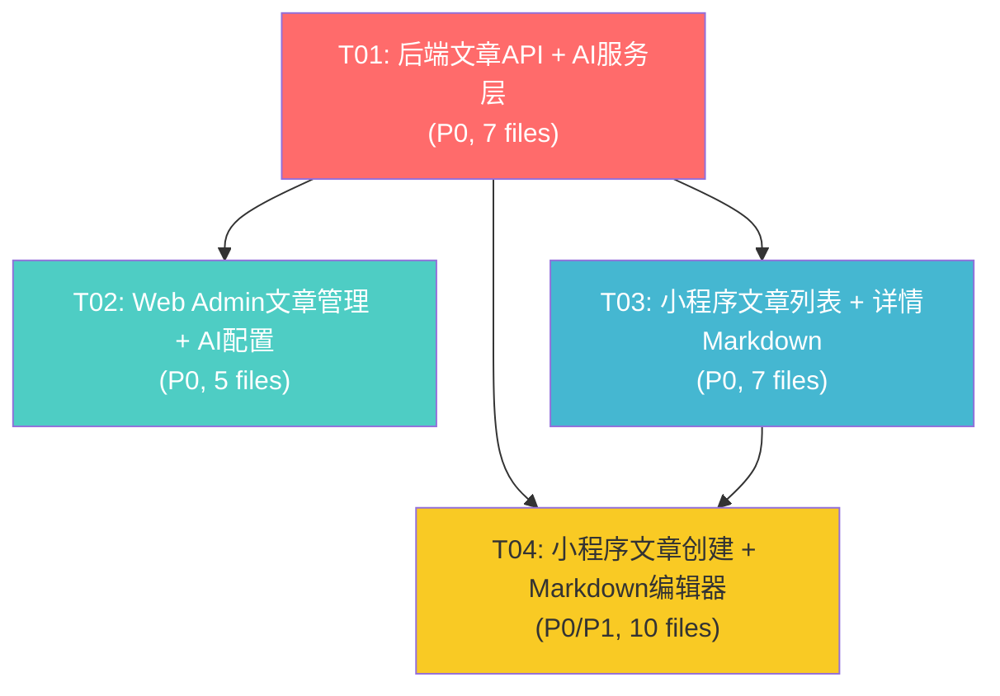

# 文章模块系统设计文档

> 项目：考试宝 — 文章模块增量开发
> 架构师：高见远（Bob）
> 日期：2026-01
> 状态：已完成，待评审

---

## 目录

- [Part A: System Design](#part-a-system-design)
  - [1. Implementation Approach](#1-implementation-approach)
  - [2. File List](#2-file-list)
  - [3. Data Structures and Interfaces](#3-data-structures-and-interfaces)
  - [4. Program Call Flow](#4-program-call-flow)
  - [5. Anything UNCLEAR](#5-anything-unclear)
- [Part B: Task Decomposition](#part-b-task-decomposition)
  - [6. Required Packages](#6-required-packages)
  - [7. Task List](#7-task-list)
  - [8. Shared Knowledge](#8-shared-knowledge)
  - [9. Task Dependency Graph](#9-task-dependency-graph)

---

## Part A: System Design

### 1. Implementation Approach

#### 1.1 项目定位

这是**增量开发**，不是从零新建项目。三端技术栈已确定：

| 端 | 技术栈 | 端口/路径 |
|---|---|---|
| 后端 | Django 4.x + SQLite | `127.0.0.1:8000` |
| Web 管理后台 | Vue 3 + Element Plus + Vite | `localhost:5173`，`/api` 代理到后端 |
| 小程序 | 微信原生（WXML/WXSS/JS） | 通过 `utils/api.js` 兼容层访问后端 |

后端采用通用文档模型 `core.Document(collection, doc_id, data)` 模拟微信云开发数据库语义，文章数据存储在 `collection='articles'` 的 Document 中，无需新建 Django Model。

#### 1.2 核心技术挑战

**挑战一：文章数据结构扩展（后端无 schema 变更）**

现有文章仅有 `title/summary/content/cover/views/createTime` 字段。需扩展 `images[]`, `tags[]`, `status`, `author`, `updateTime`, `rejectReason` 等字段。由于使用 JSONField 存储，**无需数据库迁移**，只需在代码层定义字段约定和校验逻辑。

- 解决方案：在 `adminapi/views_data.py` 的 `RESOURCES` 字典中注册 `articles` 资源，添加 `_validate_article` 校验函数确保字段完整性。小程序端提交时由 `core/views.py` 自动注入 `status='pending'` 和 `_openid`。

**挑战二：AI 辅助撰写（后端代理 LLM 调用）**

后端目前无任何 AI/LLM 配置。需新增 AI 配置存储 + LLM 代理调用接口，支持 OpenAI 兼容格式（`/v1/chat/completions`）。

- 解决方案：AI 配置存储在 `collection='ai_config'` 的 Document 中（`doc_id='ai-config'`），管理端可读写。新增 `adminapi/views_ai.py` 实现 AI 配置管理 + AI 辅助撰写代理接口，后端使用 `urllib.request`（Python 标准库，无需安装第三方包）调用外部 LLM 服务。

**挑战三：小程序 Markdown 渲染**

微信小程序原生不支持 Markdown 渲染。现有详情页使用 `{{article.content}}` 纯文本展示。需将 Markdown 转换为小程序可渲染的结构。

- 解决方案：新建 `miniprogram/utils/markdown.js` 轻量级 Markdown 解析器，将 Markdown 文本转换为 `rich-text` 组件可渲染的 nodes 数组。支持标题、加粗、图片、表格、列表、代码块等常用语法。不引入 `towxml` 等重型库，避免小程序包体积膨胀。

**挑战四：小程序 Markdown 编辑器**

小程序无现成 Markdown 编辑器组件。PRD 要求"支持文本/图片/表格"。

- 解决方案：新建 `miniprogram/components/md-editor/` 自定义组件，基于 `textarea` + 工具栏按钮（插入标题/加粗/图片/表格等语法标记）。图片通过 `wx.chooseMedia` 上传到后端 `/api/admin/upload/`（已有接口），返回 URL 后以 `` 格式插入文本。保持轻量实用，不做所见即所得预览。

**挑战五：文章审核工作流**

需实现 pending → published/rejected → taken_down 的状态流转。管理端需要审核操作接口（通过/驳回/下架），小程序端列表只展示 published 文章。

- 解决方案：在 `views_data.py` 新增 `article_audit` 视图函数，通过 `PATCH /api/admin/articles/<id>/audit/` 接收 `{action, reason}`，执行状态流转。小程序端 `core/views.py` 的 `collection_list` 对 articles 集合自动过滤 `status=published`（当请求未指定 status 时）。

#### 1.3 架构模式

沿用现有架构模式，不引入新模式：

- **后端**：通用集合资源 CRUD（`RESOURCES` 字典驱动）+ 专用视图（审核、AI）。MVC 变体（Model=Document, View=views_data/views_ai, Controller=urls）。
- **Web 管理后台**：`resource(name)` 工厂 + 页面组件直接调用 API。与 `StudyNotes.vue` 同构。
- **小程序**：`utils/api.js` 兼容层 + Page 对象 + 自定义组件。

#### 1.4 框架/库选型

| 需求 | 选型 | 理由 |
|---|---|---|
| LLM HTTP 调用 | `urllib.request`（Python 标准库） | 无需安装第三方包，本地开发足够 |
| 小程序 Markdown 渲染 | 自定义 `markdown.js` + `rich-text` | 避免引入 towxml 等重型库 |
| 小程序 Markdown 编辑 | 自定义 `md-editor` 组件 | textarea + 工具栏，轻量实用 |
| Web Admin Markdown 预览 | Element Plus `el-input` textarea | 管理端编辑用纯 textarea，参考 StudyNotes 模式 |
| 图片上传 | 复用已有 `/api/admin/upload/` | 管理端已有，小程序端新增上传逻辑 |

---

### 2. File List

#### 2.1 后端（Backend）— 6 个文件修改 + 1 个新建

| # | 文件路径 | 操作 | 说明 |
|---|---|---|---|
| B1 | `backend/adminapi/permissions.py` | **修改** | 新增 `article.view`, `article.manage`, `article.audit`, `ai.config`, `ai.use` 权限点；更新 `DEFAULT_ROLE_PERMISSIONS` |
| B2 | `backend/adminapi/views_data.py` | **修改** | `RESOURCES` 字典注册 `articles` 资源；新增 `_validate_article` 校验函数；新增 `article_audit` 审核视图 |
| B3 | `backend/adminapi/urls.py` | **修改** | 注册 articles 路由 + article audit 路由 + AI 配置/辅助路由 |
| B4 | `backend/adminapi/views_ai.py` | **新建** | AI 配置管理（GET/PUT `/api/admin/ai/config/`）+ AI 辅助撰写（POST `/api/ai/assist/`） |
| B5 | `backend/backend/settings.py` | **修改** | 新增 `AI_CONFIG_DEFAULTS` 默认配置项 |
| B6 | `backend/core/views.py` | **修改** | articles 集合特殊处理：列表默认过滤 published；详情页浏览量自增；创建时注入 status/author |
| B7 | `backend/core/management/commands/seed_articles.py` | **修改** | 更新种子数据，增加 images/tags/status/author/updateTime 字段 |

#### 2.2 Web 管理后台（Web Admin）— 2 个文件修改 + 3 个新建

| # | 文件路径 | 操作 | 说明 |
|---|---|---|---|
| W1 | `web-admin/src/router/index.js` | **修改** | 新增 articles 路由（列表+编辑）+ ai-config 路由；navGroups content 组新增菜单项 |
| W2 | `web-admin/src/api/index.js` | **修改** | 新增 `articleApi`（含 audit 方法）+ `aiApi`（config CRUD + assist） |
| W3 | `web-admin/src/views/Articles.vue` | **新建** | 文章管理列表页：状态筛选、搜索、审核操作（通过/驳回/下架）、批量删除 |
| W4 | `web-admin/src/views/ArticleEdit.vue` | **新建** | 文章编辑页：表单编辑（标题/摘要/正文/图片/标签/状态）+ Markdown 预览 |
| W5 | `web-admin/src/views/AIConfig.vue` | **新建** | AI 配置页：API 链接/密钥/模型/系统提示词/参数配置 + 连接测试 |

#### 2.3 小程序（Miniprogram）— 6 个文件修改 + 10 个新建

| # | 文件路径 | 操作 | 说明 |
|---|---|---|---|
| M1 | `miniprogram/app.json` | **修改** | `pages` 数组新增 `pages/article/create` |
| M2 | `miniprogram/pages/articles/index.js` | **修改** | 过滤 published 文章、排序（按 views 降序）、下拉刷新/上拉加载分页 |
| M3 | `miniprogram/pages/articles/index.wxml` | **修改** | 多图卡片布局（1-3图）、标签展示、浏览量、爆火标志🔥、创建入口按钮 |
| M4 | `miniprogram/pages/articles/index.wxss` | **修改** | 新卡片样式：图片网格、标签胶囊、爆火标志 |
| M5 | `miniprogram/pages/article/detail.js` | **修改** | 浏览量自增、调用 markdown.js 解析 content |
| M6 | `miniprogram/pages/article/detail.wxml` | **修改** | 使用 `rich-text` 渲染 Markdown 解析后的 nodes |
| M7 | `miniprogram/pages/article/detail.wxss` | **修改** | Markdown 富文本样式（标题/段落/图片/表格/代码块） |
| M8 | `miniprogram/pages/article/create.js` | **新建** | 文章创建页逻辑：表单数据、图片选择上传、AI 辅助调用、提交 |
| M9 | `miniprogram/pages/article/create.wxml` | **新建** | 创建页 UI：表单输入 + md-editor 组件 + AI 辅助按钮 + 标签输入 |
| M10 | `miniprogram/pages/article/create.wxss` | **新建** | 创建页样式 |
| M11 | `miniprogram/pages/article/create.json` | **新建** | 创建页配置（引入 md-editor 组件） |
| M12 | `miniprogram/components/md-editor/md-editor.js` | **新建** | Markdown 编辑器组件逻辑 |
| M13 | `miniprogram/components/md-editor/md-editor.wxml` | **新建** | 编辑器 UI：textarea + 工具栏按钮 |
| M14 | `miniprogram/components/md-editor/md-editor.wxss` | **新建** | 编辑器样式 |
| M15 | `miniprogram/components/md-editor/md-editor.json` | **新建** | 组件配置 |
| M16 | `miniprogram/utils/markdown.js` | **新建** | 轻量 Markdown → rich-text nodes 解析器 |
| M17 | `miniprogram/utils/api.js` | **修改** | 新增 `aiAssist` 方法（POST `/api/ai/assist/`） |

**合计：13 个文件修改 + 14 个文件新建 = 27 个文件**

---

### 3. Data Structures and Interfaces

> 完整 Mermaid classDiagram 见 `docs/class-diagram.mermaid`

#### 3.1 文章数据结构（ArticleData）

存储于 `Document(collection='articles', data={...})`，字段约定：

```python
{
    "_id": "art-001",              # 文档 ID（客户端指定或自动生成）
    "_openid": "user-openid",      # 创建者 openid（自动注入）
    "title": "高效刷题的五个方法",   # 标题（必填）
    "summary": "盲目刷题不如...",    # 摘要（选填，列表展示用）
    "content": "## 标题\n\n正文...", # Markdown 格式正文（必填）
    "images": [                     # 图片 URL 数组（0-3 张）
        "http://127.0.0.1:8000/media/xxx/1.jpg",
        "http://127.0.0.1:8000/media/xxx/2.jpg"
    ],
    "cover": "http://...1.jpg",     # 封面图（= images[0]，向后兼容）
    "tags": ["备考", "技巧", "规划"], # 标签数组（最多 5 个，列表展示最多 3 个）
    "status": "pending",            # 状态：pending|published|rejected|taken_down
    "author": "张三",               # 作者名称（小程序端取 userInfo.nickName）
    "views": 1024,                  # 浏览量
    "createTime": "2026/09/01 10:00",  # 创建时间（字符串，兼容现有数据）
    "updateTime": "2026/09/01 10:00",  # 更新时间（审核/编辑时更新）
    "rejectReason": ""              # 驳回原因（仅 status=rejected 时有值）
}
```

**状态流转图：**

```
pending ──publish──> published
pending ──reject───> rejected
published ─takedown─> taken_down
rejected ──publish──> published（管理员重新审核通过）
taken_down ─publish─> published（管理员恢复上架）
```

#### 3.2 AI 配置数据结构（AIConfig）

存储于 `Document(collection='ai_config', doc_id='ai-config', data={...})`：

```python
{
    "_id": "ai-config",
    "apiUrl": "https://api.openai.com/v1/chat/completions",
    "apiKey": "sk-xxxxxxxxxxxx",
    "model": "gpt-4o-mini",
    "systemPrompt": "你是一个专业的备考文章写作助手，请根据用户给出的主题，撰写一篇结构清晰、内容充实的 Markdown 格式备考文章。",
    "temperature": 0.7,
    "maxTokens": 2000,
    "enabled": true
}
```

#### 3.3 后端接口定义

##### 3.3.1 管理端接口（`/api/admin/articles/`）

| 方法 | 路径 | 权限 | 说明 |
|---|---|---|---|
| GET | `/api/admin/articles/` | `article.view` | 文章列表（支持 `keyword`, `status`, `tag` 筛选 + 分页） |
| POST | `/api/admin/articles/` | `article.manage` | 新建文章 |
| GET | `/api/admin/articles/<id>/` | `article.view` | 文章详情 |
| PUT | `/api/admin/articles/<id>/` | `article.manage` | 全量更新文章 |
| PATCH | `/api/admin/articles/<id>/` | `article.manage` | 局部更新文章 |
| DELETE | `/api/admin/articles/<id>/` | `article.manage` | 删除文章 |
| POST | `/api/admin/articles/bulk-delete/` | `article.manage` | 批量删除 |
| PATCH | `/api/admin/articles/<id>/audit/` | `article.audit` | **审核操作** `{action: publish\|reject\|takedown, reason?: string}` |

##### 3.3.2 AI 接口（`/api/admin/ai/`）

| 方法 | 路径 | 权限 | 说明 |
|---|---|---|---|
| GET | `/api/admin/ai/config/` | `ai.config` | 获取 AI 配置（apiKey 脱敏返回） |
| PUT | `/api/admin/ai/config/` | `ai.config` | 保存 AI 配置 |
| POST | `/api/admin/ai/test/` | `ai.config` | 测试 AI 连接（发送简单 prompt 验证连通性） |

##### 3.3.3 小程序端 AI 接口（`/api/ai/`）

| 方法 | 路径 | 鉴权 | 说明 |
|---|---|---|---|
| POST | `/api/ai/assist/` | X-Openid | AI 辅助撰写 `{prompt, context?, action?: generate\|improve}` |

##### 3.3.4 小程序端文章接口（复用已有 `/api/collections/articles/`）

| 方法 | 路径 | 说明 |
|---|---|---|
| GET | `/api/collections/articles/` | 文章列表（自动过滤 `status=published`） |
| GET | `/api/collections/articles/<id>/` | 文章详情（自动浏览量 +1） |
| POST | `/api/collections/articles/` | 创建文章（自动注入 `status=pending`, `_openid`, `author`） |

#### 3.4 权限点定义（新增 5 个）

| 权限码 | 名称 | 分组 |
|---|---|---|
| `article.view` | 查看文章 | 文章管理 |
| `article.manage` | 编辑文章 | 文章管理 |
| `article.audit` | 审核文章 | 文章管理 |
| `ai.config` | AI 配置管理 | AI 设置 |
| `ai.use` | 使用 AI 辅助 | AI 设置 |

默认角色权限更新：
- **superadmin**：全部权限（自动包含）
- **operator**：新增 `article.view`, `article.manage`, `article.audit`, `ai.config`, `ai.use`
- **viewer**：新增 `article.view`

---

### 4. Program Call Flow

> 完整 Mermaid sequenceDiagram 见 `docs/sequence-diagram.mermaid`

#### 4.1 文章创建 + 审核流程

**阶段一：用户创建文章（小程序端）**

```
用户填写表单 → POST /api/collections/articles/ (status=pending, _openid自动注入)
→ 后端校验字段 → Document.objects.create → 返回 _id
→ 小程序提示"已提交，待审核"
```

**阶段二：管理员审核（Web 管理后台）**

```
管理员打开文章管理页 → GET /api/admin/articles/?status=pending
→ 查看待审列表 → 查看详情 → 点击通过/驳回/下架
→ PATCH /api/admin/articles/<id>/audit/ {action, reason?}
→ 后端更新 status + updateTime → 返回成功
```

**阶段三：小程序展示已发布文章**

```
小程序文章列表页 → GET /api/collections/articles/?status=published
→ 后端过滤 published 文章 → 返回列表
→ 小程序渲染多图卡片 + 标签 + 浏览量 + 爆火标志
```

#### 4.2 AI 辅助撰写流程

```
小程序创建页 → 用户输入主题关键词 → 点击"AI 辅助撰写"
→ POST /api/ai/assist/ {prompt, context}
→ 后端读取 ai_config → 检查 enabled
→ 构建 OpenAI 兼容请求 → POST <apiUrl>/v1/chat/completions
→ LLM 返回 Markdown 内容 → 后端返回给小程序
→ 小程序填入编辑器 → 用户编辑修改 → 提交文章
```

#### 4.3 文章列表加载流程（小程序端）

```
onShow/onPullDownRefresh → db.collection('articles').where({status:'published'}).get()
→ GET /api/collections/articles/?status=published
→ 后端过滤 + 排序 → to_client() 平铺字段 → 返回 {data: [...]}
→ 小程序渲染：图片网格(1-3张) + 标题(截断2行) + 摘要(截断2行)
  + 标签(最多3个胶囊) + 浏览量 + 爆火标志(views>1000显示🔥)
```

#### 4.4 文章详情页加载 + 浏览量自增

```
onLoad(id) → db.collection('articles').doc(id).get()
→ GET /api/collections/articles/<id>/
→ 后端取文档 + 异步 views+1 → 返回文章数据
→ 小程序调用 markdown.js 解析 content → rich-text nodes
→ 渲染 rich-text 展示 Markdown 格式内容
```

---

### 5. Anything UNCLEAR

#### 5.1 假设

| # | 假设 | 影响 |
|---|---|---|
| A1 | 小程序端图片上传复用管理端 `/api/admin/upload/` 接口，但该接口需要管理员 token。小程序端可能需要新增公开上传接口，或在 `core/views.py` 新增图片上传端点。 | 中 — 若需新增上传端点，`core/views.py` 和 `core/urls.py` 需额外修改 |
| A2 | AI 配置中的 `apiKey` 在管理端 GET 返回时脱敏（仅显示后4位），PUT 时若收到脱敏值则保留原值。 | 低 — 实现细节 |
| A3 | 小程序端 Markdown 编辑器不做实时预览，仅提供语法工具栏 + textarea。提交后详情页才做 Markdown 渲染。 | 低 — 产品决策 |
| A4 | 文章浏览量自增不做防重复计数（同一用户多次打开都会计数），P2 可优化为基于 openid 去重。 | 低 — MVP 可接受 |
| A5 | 小程序端文章列表分页使用简单的 `page/page_size` 参数，由 `core/views.py` 的 `collection_list` 支持。但当前 `collection_list` 不支持分页（直接返回全部），需新增分页逻辑或前端做全量加载+前端截断。 | 中 — 需确认分页方案 |
| A6 | `articles` 不加入 `PRIVATE_COLLECTIONS`，因为文章是公开内容，但创建时仍需 `_openid`（通过请求头注入）。 | 低 — 权限设计 |

#### 5.2 待明确事项

| # | 事项 | 建议处理方式 |
|---|---|---|
| Q1 | 小程序端图片上传是否需要单独接口？现有 `/api/admin/upload/` 需管理员鉴权。 | 建议在 `core/urls.py` 新增 `/api/upload/` 公开上传端点（带 openid 校验） |
| Q2 | `core/views.py` 的 `collection_list` 当前不支持分页，文章量大时是否需要后端分页？ | P0 先全量返回前端截断显示，P1 再实现后端分页 |
| Q3 | AI 辅助撰写的 `systemPrompt` 是否允许管理员自定义？还是固定？ | 允许管理员在 AI 配置页自定义 |
| Q4 | 文章驳回后，用户在小程序端是否能看到驳回原因？是否允许重新编辑提交？ | P0 仅管理端可见驳回原因；P1 可考虑小程序端"我的文章"页面展示审核状态 |

---

## Part B: Task Decomposition

### 6. Required Packages

本项目为增量开发，**后端无需安装新的第三方包**。LLM 调用使用 Python 标准库 `urllib.request` + `json`。

前端（Web Admin）和小程序端也**无需安装新包**，全部基于现有依赖：

```
# 后端 — 无新增（Python 标准库 urllib.request 足够）
# Python 环境路径：python

# Web Admin — 无新增（Vue 3 + Element Plus 已有）
# 现有：vue@^3, element-plus, axios, vue-router, @element-plus/icons-vue

# 小程序 — 无新增（自定义 markdown.js + md-editor 组件）
# 不引入 towxml / mp-html 等第三方库
```

---

### 7. Task List

#### T01: 后端 — 文章 API + AI 服务层（P0）

| 字段 | 内容 |
|---|---|
| **Task ID** | T01 |
| **Task Name** | 后端文章资源注册 + 审核接口 + AI 配置与辅助撰写服务 |
| **Source Files** | `backend/adminapi/permissions.py`（修改）, `backend/adminapi/views_data.py`（修改）, `backend/adminapi/urls.py`（修改）, `backend/adminapi/views_ai.py`（新建）, `backend/backend/settings.py`（修改）, `backend/core/views.py`（修改）, `backend/core/management/commands/seed_articles.py`（修改） |
| **Dependencies** | 无（第一个任务，所有后续任务依赖此任务的接口定义） |
| **Priority** | P0 |

**任务内容：**

1. **permissions.py**：新增 5 个权限点（`article.view/manage/audit`, `ai.config/use`），更新 `DEFAULT_ROLE_PERMISSIONS` 的 `operator` 和 `viewer` 角色。

2. **views_data.py**：
   - `RESOURCES` 字典新增 `articles` 配置（collection='articles', search=['title','summary','tags','author'], filters=['status','tag'], validator=`_validate_article`）
   - 新增 `_validate_article(body)` 校验函数：title 必填、status 枚举校验、images 数组校验（最多3张）、tags 数组校验（最多5个）
   - 新增 `article_audit(request, doc_id)` 视图：`PATCH /api/admin/articles/<id>/audit/`，接收 `{action: 'publish'|'reject'|'takedown', reason?}`，更新 status + updateTime + rejectReason，记录操作日志

3. **urls.py**：
   - 注册 articles 路由（复用 `resource_list/resource_detail/resource_bulk_delete`）
   - 注册 `articles/<id>/audit/` → `article_audit`
   - 注册 AI 路由：`ai/config/` → `views_ai.ai_config_dispatch`, `ai/test/` → `views_ai.ai_test`
   - 注册小程序 AI 路由（在 `core/urls.py` 中）：`ai/assist/` → `views_ai.ai_assist`

4. **views_ai.py**（新建）：
   - `ai_config_dispatch(request)`：GET 返回 AI 配置（apiKey 脱敏），PUT 保存配置
   - `ai_test(request)`：POST 发送简单 prompt 测试 LLM 连通性
   - `ai_assist(request)`：POST 接收 `{prompt, context?, action?}`，读取 ai_config，调用 LLM，返回 Markdown 内容
   - `_get_ai_config()`：从 Document 读取 ai_config，合并 settings 默认值
   - `_call_llm(config, messages)`：使用 `urllib.request` 调用 OpenAI 兼容接口

5. **settings.py**：新增 `AI_CONFIG_DEFAULTS` 字典（默认 apiUrl, model, systemPrompt, temperature, maxTokens, enabled=False）

6. **core/views.py**：
   - `collection_list` 中对 `articles` 集合特殊处理：GET 请求若未指定 `status` 参数，自动过滤 `status=published`（小程序端公开列表只看已发布）
   - `collection_detail` 中对 `articles` 集合特殊处理：GET 请求自动浏览量 +1（`data['views'] += 1`）
   - `collection_list` 的 POST 中对 `articles` 集合特殊处理：自动注入 `status='pending'`、`views=0`、`createTime`、`updateTime`

7. **seed_articles.py**：更新种子数据，每篇文章增加 `images`、`tags`、`status='published'`、`author`、`updateTime` 字段

**验收标准：**
- `python manage.py seed_articles` 成功导入扩展字段的文章数据
- `GET /api/admin/articles/?status=pending` 返回待审文章
- `PATCH /api/admin/articles/<id>/audit/` 能成功执行审核操作
- `POST /api/ai/assist/` 在 AI 配置启用时返回 Markdown 内容
- 小程序 `GET /api/collections/articles/` 默认只返回 published 文章

---

#### T02: Web 管理后台 — 文章管理 + AI 配置（P0）

| 字段 | 内容 |
|---|---|
| **Task ID** | T02 |
| **Task Name** | Web 管理后台文章管理页面 + 编辑页面 + AI 配置页面 + 路由/API 注册 |
| **Source Files** | `web-admin/src/router/index.js`（修改）, `web-admin/src/api/index.js`（修改）, `web-admin/src/views/Articles.vue`（新建）, `web-admin/src/views/ArticleEdit.vue`（新建）, `web-admin/src/views/AIConfig.vue`（新建） |
| **Dependencies** | T01（依赖后端接口定义） |
| **Priority** | P0 |

**任务内容：**

1. **router/index.js**：
   - 在 `content` 分组新增路由：`articles` → `Articles.vue`（perm: `article.view`）
   - 新增隐藏路由：`articles/:id/edit` → `ArticleEdit.vue`（perm: `article.manage`）
   - 在 `system` 分组新增路由：`ai-config` → `AIConfig.vue`（perm: `ai.config`）
   - 导入 `Document`/`EditPen`/`Setting` 等图标

2. **api/index.js**：
   - 新增 `articleApi`：`resource('articles')` 工厂 + `audit(id, action, reason)` 方法 → `PATCH /articles/<id>/audit/`
   - 新增 `aiApi`：`getConfig()` → `GET /ai/config/`, `saveConfig(data)` → `PUT /ai/config/`, `test()` → `POST /ai/test/`

3. **Articles.vue**（参考 StudyNotes.vue 结构）：
   - 工具栏：关键字搜索 + 状态筛选下拉（全部/待审核/已发布/已驳回/已下架）+ 标签筛选 + 查询/重置
   - 表格列：ID、标题（点击可跳转编辑页）、作者、封面缩略图、标签（el-tag）、状态（el-tag 带颜色映射）、浏览量、更新时间、操作（详情/编辑/审核/删除）
   - 审核操作：通过（绿色按钮）、驳回（弹窗输入原因）、下架（确认弹窗）
   - 分页：el-pagination
   - 批量删除：复选框 + 批量删除按钮

4. **ArticleEdit.vue**：
   - 表单字段：标题（必填）、作者、摘要（textarea）、正文内容（textarea，提示 Markdown 格式）、图片（el-upload 多图上传，最多3张）、标签（el-select multiple 或 tag input）、状态（select：pending/published/rejected/taken_down）
   - Markdown 预览：右侧/下方实时预览区域（简单的 Markdown 转 HTML，使用 `marked` 或简单的正则替换）
   - 保存按钮：POST 新建或 PUT 更新
   - AI 辅助按钮（P1）：调用 `aiApi.assist()` 生成内容填入正文

5. **AIConfig.vue**：
   - 表单：API 地址（input）、API Key（input，密码模式）、模型名称（input/select 常用模型）、系统提示词（textarea）、Temperature（slider 0-2）、Max Tokens（input number）、启用开关（el-switch）
   - 保存按钮：PUT `/ai/config/`
   - 测试连接按钮：POST `/ai/test/`，显示测试结果
   - API Key 脱敏显示（仅后端返回后4位，编辑时若未修改则保留原值）

**验收标准：**
- 管理后台侧边栏"内容管理"组出现"文章管理"菜单
- 文章列表页能筛选状态、搜索、分页
- 审核操作（通过/驳回/下架）功能正常
- 文章编辑页能新建和编辑文章，支持图片上传和标签
- AI 配置页能保存配置并测试连接
- 系统设置组出现"AI 配置"菜单

---

#### T03: 小程序 — 文章列表 + 详情 Markdown 渲染升级（P0）

| 字段 | 内容 |
|---|---|
| **Task ID** | T03 |
| **Task Name** | 小程序文章列表多图卡片升级 + 详情页 Markdown 富文本渲染 + 浏览量自增 |
| **Source Files** | `miniprogram/pages/articles/index.js`（修改）, `miniprogram/pages/articles/index.wxml`（修改）, `miniprogram/pages/articles/index.wxss`（修改）, `miniprogram/pages/article/detail.js`（修改）, `miniprogram/pages/article/detail.wxml`（修改）, `miniprogram/pages/article/detail.wxss`（修改）, `miniprogram/utils/markdown.js`（新建） |
| **Dependencies** | T01（依赖后端文章数据结构扩展） |
| **Priority** | P0 |

**任务内容：**

1. **utils/markdown.js**（新建）：
   - `parse(md)` 主函数：将 Markdown 文本解析为 `rich-text` 组件的 nodes 数组
   - 支持语法：`# ## ###` 标题、`**bold**` 加粗、`*italic*` 斜体、`` 图片、`[text](url)` 链接、`- / 1.` 列表、`> ` 引用、`` `code` `` 行内代码、`| | |` 表格、`\n\n` 段落分隔
   - 输出格式：`[{name: 'div', children: [{type: 'text', text: '...'}], attrs: {class: 'md-h1'}}]`
   - 纯 JavaScript 实现，无第三方依赖，适合小程序环境

2. **articles/index.js**：
   - `load()`：查询时添加 `where({status: 'published'})` 过滤已发布文章
   - 数据处理：按 `views` 降序排序，截取 `images` 前3张，截取 `tags` 前3个
   - 爆火标志：`views > 1000` 时设置 `isHot: true`
   - 新增 `openCreate()`：跳转到 `/pages/article/create`
   - 下拉刷新 `onPullDownRefresh` + 上拉加载 `onReachBottom`（P2 可选）

3. **articles/index.wxml**：
   - 顶部：创建文章入口按钮（浮动或顶部栏）
   - 卡片布局：
     - 无图模式：标题 + 摘要 + 标签 + 浏览量
     - 单图模式：左文右图（保留现有布局优化）
     - 三图模式：上方标题+摘要，下方三图横排
   - 标签：`<view class="tag" wx:for="{{item.displayTags}}">{{item}}</view>` 胶囊样式
   - 爆火标志：`<view wx:if="{{item.isHot}}" class="hot-badge">🔥爆火</view>`
   - 浏览量：`<text class="views">{{item.views}} 阅读</text>`

4. **articles/index.wxss**：
   - 新卡片样式：圆角阴影、图片网格（三图等分）、标签胶囊、爆火标志渐变背景
   - 响应式适配不同图片数量

5. **article/detail.js**：
   - `onLoad`：获取文章后调用 `markdown.parse(article.content)` 得到 `contentNodes`
   - `setData({article, contentNodes})`
   - 浏览量自增由后端自动处理（无需前端额外请求）

6. **article/detail.wxml**：
   - 标题区：`<view class="detail-title">{{article.title}}</view>`
   - 元信息：作者 · 时间 · 浏览量 · 标签
   - 图片轮播（如有 images）：`<swiper>` 展示多图
   - 正文：`<rich-text nodes="{{contentNodes}}" class="detail-content"></rich-text>`

7. **article/detail.wxss**：
   - Markdown 富文本样式：`.md-h1` / `.md-h2` / `.md-p` / `.md-img` / `.md-table` / `.md-code` / `.md-blockquote` 等
   - 图片自适应宽度 `max-width: 100%`
   - 表格边框样式

**验收标准：**
- 文章列表展示多图卡片、标签、浏览量、爆火标志
- 仅展示已发布（published）文章
- 点击文章进入详情页，Markdown 正文正确渲染为富文本
- 详情页图片正常显示
- 浏览量在打开详情页后自增

---

#### T04: 小程序 — 文章创建页 + Markdown 编辑器组件（P0）

| 字段 | 内容 |
|---|---|
| **Task ID** | T04 |
| **Task Name** | 小程序文章创建页面 + 自定义 Markdown 编辑器组件 + AI 辅助撰写集成 + API 兼容层扩展 |
| **Source Files** | `miniprogram/app.json`（修改）, `miniprogram/pages/article/create.js`（新建）, `miniprogram/pages/article/create.wxml`（新建）, `miniprogram/pages/article/create.wxss`（新建）, `miniprogram/pages/article/create.json`（新建）, `miniprogram/components/md-editor/md-editor.js`（新建）, `miniprogram/components/md-editor/md-editor.wxml`（新建）, `miniprogram/components/md-editor/md-editor.wxss`（新建）, `miniprogram/components/md-editor/md-editor.json`（新建）, `miniprogram/utils/api.js`（修改） |
| **Dependencies** | T01（依赖后端创建接口和 AI 接口）, T03（依赖 markdown.js） |
| **Priority** | P0（AI 辅助部分为 P1） |

**任务内容：**

1. **app.json**：`pages` 数组新增 `"pages/article/create"`

2. **components/md-editor/**（新建自定义组件）：
   - **md-editor.json**：`{"component": true}`
   - **md-editor.js**：
     - `properties`: `value`（String，绑定值）, `placeholder`（String）
     - `data`: `toolbar` 工具栏配置（标题/加粗/斜体/图片/列表/表格/引用/代码）
     - `methods`:
       - `onInput(e)`: 更新内部值，`triggerEvent('input', {value})` 通知父组件
       - `insertSyntax(type)`: 在光标位置插入 Markdown 语法标记（`# `, `**`, `*`, `- `, `> `, `` ` ``等）
       - `chooseImage()`: 调用 `wx.chooseMedia` 选择图片 → 上传到后端 → 插入 ``
       - `insertTable()`: 插入表格模板 `| 列1 | 列2 |\n|---|---|\n| | |`
   - **md-editor.wxml**：
     - 工具栏：横向滚动的按钮列表（`#`、`B`、`I`、`图片`、`列表`、`表格`、`引用`、`代码`）
     - 编辑区：`<textarea>` 绑定 value，auto-height，show-confirm-bar
     - 字数统计：底部显示当前字数
   - **md-editor.wxss**：工具栏按钮样式、textarea 样式

3. **pages/article/create.js**（新建）：
   - `data`: `form: {title, summary, content, images, tags}`, `tagsInput`, `aiLoading`
   - `onTitleInput(e)` / `onSummaryInput(e)`：表单双向绑定
   - `onEditorInput(e)`：接收 md-editor 的 input 事件
   - `onTagsInput(e)`：标签输入（逗号分隔或回车添加）
   - `chooseCoverImage()`：`wx.chooseMedia` 选择 1-3 张图片 → 上传 → 存入 `form.images`
   - `aiAssist()`：调用 `api.aiAssist({prompt: form.title, context: '备考文章'})` → 将返回的 content 填入编辑器
   - `submit()`：校验必填字段 → `db.collection('articles').add({data: form})` → 提示"已提交，待审核" → `wx.navigateBack()`

4. **pages/article/create.wxml**（新建）：
   - 导航栏标题"写文章"
   - 表单：标题输入框、摘要输入框
   - 图片选择区：1-3 张图片网格 + 上传按钮
   - `<md-editor value="{{form.content}}" bind:input="onEditorInput" placeholder="请输入文章正文..." />`
   - 标签输入：`<input>` + 已选标签展示
   - AI 辅助按钮：`<button loading="{{aiLoading}}" bindtap="aiAssist">AI 辅助撰写</button>`
   - 提交按钮：`<button type="primary" bindtap="submit">提交审核</button>`

5. **pages/article/create.wxss**（新建）：表单样式、图片网格、按钮样式

6. **pages/article/create.json**（新建）：`{"usingComponents": {"md-editor": "/components/md-editor/md-editor"}}`

7. **utils/api.js**（修改）：
   - 新增 `aiAssist(data)` 函数：`return request('POST', '/ai/assist/', data)`
   - 新增 `uploadImage(filePath)` 函数：`wx.uploadFile` 上传到 `/api/upload/`（若后端新增公开上传端点）或复用管理端上传

**验收标准：**
- 从文章列表页可进入创建页
- 创建页表单填写正常，Markdown 编辑器工具栏可插入语法标记
- 图片可选择并上传，以 `` 格式插入正文
- 提交文章后提示"已提交，待审核"并返回列表页
- AI 辅助撰写按钮（在 AI 配置启用时）能生成内容填入编辑器
- 创建的文章在管理后台审核列表中可见

---

### 8. Shared Knowledge

> 以下为跨任务共享的约定，工程师在实现时需遵守：

#### 8.1 后端约定

```
- 所有管理端接口（/api/admin/）统一返回 {code, message, data} 信封
  - code=0 成功，非 0 见 ErrorCode
  - 分页列表 data 固定为 {list, total, page, page_size, total_pages}
- 所有小程序端接口（/api/）返回云开发兼容格式
  - 集合查询返回 {data: [...]}
  - 文档详情返回 {data: {...}}
  - 新增返回 {_id: "..."}
- 文章集合名：articles（已存在于 ALLOWED_COLLECTIONS）
- AI 配置集合名：ai_config（需新增到 ALLOWED_COLLECTIONS 或通过专用接口访问）
- 文章状态枚举：pending | published | rejected | taken_down
- 文章审核操作枚举：publish | reject | takedown
- 文章 images 最多 3 张，tags 最多 5 个（列表展示最多 3 个）
- 浏览量自增在后端 collection_detail 中自动执行，前端无需额外请求
- AI 配置 apiKey 在管理端 GET 时脱敏（仅显示后4位），PUT 时若值为脱敏格式则保留原值
- LLM 调用使用 Python 标准库 urllib.request，不安装 requests 等第三方包
- LLM 请求格式：OpenAI 兼容 {model, messages, temperature, max_tokens}
- LLM 响应提取：response['choices'][0]['message']['content']
- 权限校验：管理端接口使用 @perm.require_perms 装饰器
- 操作日志：审核操作需调用 perm.log_action 记录
```

#### 8.2 Web Admin 约定

```
- API 实例 baseURL=/api/admin，响应拦截器自动解包 data 字段
- articleApi = resource('articles') 工厂 + 自定义 audit 方法
- 文章状态颜色映射：pending→warning, published→success, rejected→danger, taken_down→info
- 文章编辑页路由：/articles/:id/edit（hidden 路由，不在侧边栏显示）
- AI 配置页路由：/ai-config（在 system 分组下）
- 图片上传使用 uploadApi.image(file)（已有）
- Markdown 预览可用简单正则替换（不引入 marked 库，保持轻量）
- 参考 StudyNotes.vue 的页面结构和交互模式
```

#### 8.3 小程序约定

```
- API 兼容层：api.database().collection('articles') 映射到 Django HTTP
- 文章列表查询自动带 status=published 过滤（后端处理）
- 文章详情打开后浏览量自动 +1（后端处理）
- Markdown 解析使用 utils/markdown.js，输出 rich-text nodes 格式
- Markdown 编辑器使用 components/md-editor 自定义组件
- 图片上传：wx.chooseMedia → wx.uploadFile → 获取 URL → 插入 
- AI 辅助：api.aiAssist({prompt, context}) → POST /api/ai/assist/
- 创建文章时 status 自动设为 pending（后端处理）
- 创建文章时 _openid 自动注入（请求头 X-Openid）
- 创建文章时 author 从 userInfo.nickName 获取（前端传入）
- 标签输入：逗号或回车分隔，最多 5 个
- 爆火标志阈值：views > 1000
```

#### 8.4 数据兼容性

```
- 现有种子数据（seed_articles）只有 title/summary/content/cover/views/createTime
- 新增字段 images/tags/status/author/updateTime 需有默认值：
  - images: []（空数组，列表页不显示图片区域）
  - tags: []（空数组，列表页不显示标签）
  - status: 'published'（种子数据默认已发布）
  - author: '考试宝'（默认作者）
  - updateTime: 等于 createTime
- cover 字段保留向后兼容：= images[0]（若有图片），无图片则为空
```

---

### 9. Task Dependency Graph



**依赖说明：**

| 任务 | 依赖 | 原因 |
|---|---|---|
| T01 | 无 | 后端是所有前端接口的提供者，必须最先完成 |
| T02 | T01 | Web Admin 调用后端 `/api/admin/articles/` 和 `/api/admin/ai/` 接口 |
| T03 | T01 | 小程序文章列表/详情依赖后端扩展后的文章数据结构 |
| T04 | T01, T03 | 创建页调用后端创建接口和 AI 接口；同时依赖 T03 的 `markdown.js`（编辑器预览可复用） |

**并行可行性：**
- T02 和 T03 可在 T01 完成后并行开发（互不依赖）
- T04 依赖 T03 的 markdown.js，需在 T03 之后或与 T03 协调开发

---

## 附录：文件修改详情矩阵

| 文件 | T01 | T02 | T03 | T04 | 修改类型 |
|---|:---:|:---:|:---:|:---:|---|
| `backend/adminapi/permissions.py` | ✅ | | | | 新增权限点 |
| `backend/adminapi/views_data.py` | ✅ | | | | 注册资源 + 审核视图 |
| `backend/adminapi/urls.py` | ✅ | | | | 注册路由 |
| `backend/adminapi/views_ai.py` | ✅ | | | | **新建** |
| `backend/backend/settings.py` | ✅ | | | | AI 默认配置 |
| `backend/core/views.py` | ✅ | | | | articles 特殊处理 |
| `backend/core/management/commands/seed_articles.py` | ✅ | | | | 更新种子数据 |
| `web-admin/src/router/index.js` | | ✅ | | | 新增路由 |
| `web-admin/src/api/index.js` | | ✅ | | | 新增 API |
| `web-admin/src/views/Articles.vue` | | ✅ | | | **新建** |
| `web-admin/src/views/ArticleEdit.vue` | | ✅ | | | **新建** |
| `web-admin/src/views/AIConfig.vue` | | ✅ | | | **新建** |
| `miniprogram/pages/articles/index.js` | | | ✅ | | 升级列表逻辑 |
| `miniprogram/pages/articles/index.wxml` | | | ✅ | | 升级卡片布局 |
| `miniprogram/pages/articles/index.wxss` | | | ✅ | | 升级卡片样式 |
| `miniprogram/pages/article/detail.js` | | | ✅ | | Markdown 解析 |
| `miniprogram/pages/article/detail.wxml` | | | ✅ | | rich-text 渲染 |
| `miniprogram/pages/article/detail.wxss` | | | ✅ | | Markdown 样式 |
| `miniprogram/utils/markdown.js` | | | ✅ | | **新建** |
| `miniprogram/app.json` | | | | ✅ | 新增页面路由 |
| `miniprogram/pages/article/create.js` | | | | ✅ | **新建** |
| `miniprogram/pages/article/create.wxml` | | | | ✅ | **新建** |
| `miniprogram/pages/article/create.wxss` | | | | ✅ | **新建** |
| `miniprogram/pages/article/create.json` | | | | ✅ | **新建** |
| `miniprogram/components/md-editor/md-editor.js` | | | | ✅ | **新建** |
| `miniprogram/components/md-editor/md-editor.wxml` | | | | ✅ | **新建** |
| `miniprogram/components/md-editor/md-editor.wxss` | | | | ✅ | **新建** |
| `miniprogram/components/md-editor/md-editor.json` | | | | ✅ | **新建** |
| `miniprogram/utils/api.js` | | | | ✅ | 新增 aiAssist |
